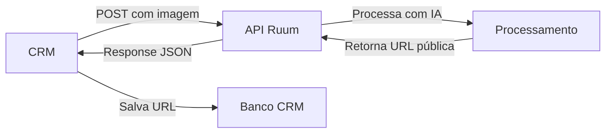

# 🏢 API Ruum - Documentação para Integração CRM

> **Versão:** 1.0  
> **Data:** Fevereiro 2026  
> **Público:** Parceiros CRM Imobiliário

---

## 📋 Visão Geral

Esta documentação é destinada à integração da API Ruum com plataformas de CRM imobiliário. Nossa API oferece processamento automatizado de imagens e vídeos para marketing imobiliário, incluindo:

- **Virtual Staging** - Mobília virtual em ambientes vazios
- **Vídeos Antes e Depois** - Comparação animada de ambientes
- **Magic Motion** - Adiciona movimento cinematográfico a imagens
- **Magic Drop** - Animação de móveis "caindo" no ambiente

---

## 🎯 Diferenças para Integração CRM

Esta integração possui características especiais:

✅ **Processamento Automático** - Sem necessidade de aprovação manual  
✅ **Retorno Direto** - URLs públicas dos arquivos processados  
✅ **Sem Persistência** - Nada é salvo no Airtable da Ruum  
✅ **Autonomia Total** - Vocês gerenciam o armazenamento e dados

---

## 📚 Índice da Documentação

### 🚀 Início Rápido
- [**QUICKSTART.md**](./QUICKSTART.md) - Comece aqui! Seu primeiro request em 5 minutos

### 🖼️ Virtual Staging
- [**VIRTUAL_STAGING.md**](./VIRTUAL_STAGING.md) - Geração de mobília virtual com IA

### 🎬 Processamento de Vídeos
- [**VIDEO_BEFORE_AFTER.md**](./VIDEO_BEFORE_AFTER.md) - Vídeo comparativo Antes/Depois
- [**VIDEO_MAGIC_MOTION.md**](./VIDEO_MAGIC_MOTION.md) - Adiciona movimento cinematográfico
- [**VIDEO_MAGIC_DROP.md**](./VIDEO_MAGIC_DROP.md) - Animação de móveis caindo

### ⚙️ Referências Técnicas
- [**AUTHENTICATION.md**](./AUTHENTICATION.md) - Autenticação e segurança
- [**ERROR_CODES.md**](./ERROR_CODES.md) - Códigos de erro e troubleshooting
- [**RATE_LIMITS.md**](./RATE_LIMITS.md) - Limites de uso e quotas

---

## 🔗 URL Base da API

```
https://apiruum-562831020087.us-central1.run.app
```

**Ambiente de Testes (Staging):**
```
https://apiruum-staging-562831020087.us-central1.run.app
```

---

## 🏗️ Arquitetura de Integração



### Fluxo Típico:

1. **CRM envia** imagem/vídeo via POST
2. **API Ruum processa** com IA
3. **API retorna** URL pública do arquivo processado
4. **CRM armazena** URL no seu sistema
5. **Usuário final** acessa arquivo via URL pública

---

## ⚡ Tempos Médios de Processamento

| Funcionalidade | Tempo Médio | Tipo |
|----------------|-------------|------|
| Virtual Staging | 30-60s | Síncrono |
| Vídeo Antes/Depois | 15-30s | Síncrono |
| Magic Motion | 2-5min | Assíncrono (polling) |
| Magic Drop | 3-8min | Assíncrono (polling) |

**Síncrono:** Resposta imediata com resultado  
**Assíncrono:** Requer polling para verificar status

---

## 📊 Formato Padrão de Resposta

### ✅ Sucesso (Virtual Staging)
```json
{
  "success": true,
  "data": {
    "generatedImageUrl": "https://storage.googleapis.com/bucket/image_123.jpg",
    "originalImageUrl": "https://storage.googleapis.com/bucket/original_123.jpg",
    "metadata": {
      "designStyle": "scandinavian",
      "roomType": "living_room",
      "qualityScore": 5,
      "processingTime": "42s"
    }
  }
}
```

### ❌ Erro
```json
{
  "success": false,
  "error": {
    "code": "INVALID_IMAGE",
    "message": "A imagem fornecida não é válida ou está corrompida",
    "details": "Supported formats: JPG, PNG, WebP"
  }
}
```

---

## 🔒 Segurança

- **HTTPS obrigatório** em todas as requisições
- **API Key** via header `Authorization: Bearer YOUR_API_KEY`
- **Rate limiting** aplicado por IP e API Key
- **URLs públicas** com URLs assinadas (expiração configurável)

---

## 🆘 Suporte

- **Email:** suporte@ruum.com.br
- **Slack:** Canal dedicado ao parceiro
- **Documentação:** Esta pasta
- **Status da API:** https://status.ruum.com.br

---

## 📝 Changelog

### v1.0 (Fev 2026)
- ✨ Documentação inicial para integração CRM
- 🎯 Modo automático (sem aprovação manual)
- 🔄 Retorno direto de URLs públicas
- 📦 Sem persistência em Airtable

---

## ⚖️ Termos de Uso

- URLs públicas têm **validade de 7 dias** por padrão
- Quota mensal será definida no contrato
- Proibido revender ou redistribuir a API
- SLA: 99.5% uptime mensal

---

**Pronto para começar?** 👉 [Veja o Quick Start Guide](./QUICKSTART.md)
