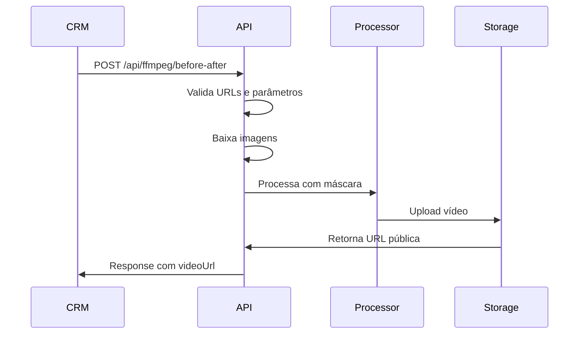

# 🎬 Vídeo Antes e Depois

> Gera vídeo comparativo com transição animada entre dois ambientes (vazio → mobiliado)

---

## 📋 Visão Geral

O endpoint **Before/After Video** cria um vídeo profissional que:

1. Exibe a imagem "Antes" (ambiente vazio)
2. Transição suave com máscara de revelação
3. Revela a imagem "Depois" (ambiente mobiliado)
4. Efeito visual impactante para marketing imobiliário

---

## 🎯 Endpoint

```
POST /api/ffmpeg/before-after
```

**Tipo:** Síncrono (resposta imediata)  
**Tempo médio:** 15-30 segundos  
**Timeout:** 60 segundos

---

## 📨 Request

### Headers

```
Authorization: Bearer YOUR_API_KEY
Content-Type: application/json
```

### Body Parameters

| Parâmetro | Tipo | Obrigatório | Default | Descrição |
|-----------|------|-------------|---------|-----------|
| `bottom` | string | ✅ | - | URL da imagem "ANTES" (ambiente vazio) |
| `top` | string | ✅ | - | URL da imagem "DEPOIS" (ambiente mobiliado) |
| `mask` | string | ❌ | `center_wipe` | Tipo de transição (veja máscaras abaixo) |
| `duration` | number | ❌ | `5` | Duração total em segundos (3-15) |
| `quality` | string | ❌ | `high` | Qualidade do vídeo (`low`, `medium`, `high`, `ultra`) |
| `aspectRatio` | string | ❌ | `16:9` | Proporção do vídeo (`16:9`, `9:16`, `1:1`, `4:3`) |

### Exemplo de Request

```bash
curl -X POST https://apiruum-562831020087.us-central1.run.app/api/ffmpeg/before-after \
  -H "Authorization: Bearer YOUR_API_KEY" \
  -H "Content-Type: application/json" \
  -d '{
    "bottom": "https://storage.example.com/empty-room.jpg",
    "top": "https://storage.example.com/furnished-room.jpg",
    "mask": "center_wipe",
    "duration": 5,
    "quality": "high"
  }'
```

---

## 📬 Response

### ✅ Sucesso (200 OK)

```json
{
  "success": true,
  "data": {
    "videoUrl": "https://storage.googleapis.com/ruum-videos/before_after_abc123.mp4",
    "thumbnailUrl": "https://storage.googleapis.com/ruum-videos/thumb_abc123.jpg",
    "metadata": {
      "duration": 5,
      "quality": "high",
      "resolution": "1920x1080",
      "fps": 30,
      "codec": "h264",
      "fileSize": "2.8MB",
      "aspectRatio": "16:9",
      "mask": "center_wipe",
      "processingTime": "18s",
      "timestamp": "2026-02-02T15:00:00Z"
    }
  }
}
```

### ❌ Erro (4xx/5xx)

```json
{
  "success": false,
  "error": {
    "code": "INVALID_IMAGE_DIMENSIONS",
    "message": "As imagens 'bottom' e 'top' devem ter as mesmas dimensões",
    "details": "bottom: 1920x1080, top: 1280x720",
    "timestamp": "2026-02-02T15:05:00Z"
  }
}
```

---

## 🎭 Tipos de Máscara (Transições)

### 1. Center Wipe (`center_wipe`) - **PADRÃO**
Revelação do centro para as bordas em formato circular/elíptico.

**Visual:**
```
Antes ████████████
       ██████▓▓▓▓██  
       ███░░░░░░███  <- Centro revela primeiro
       ██████▓▓▓▓██
Depois ████████████
```

**Melhor para:** Salas de estar, quartos, qualquer ambiente centrado

### 2. Left to Right (`left_right`)
Revelação da esquerda para a direita (efeito cortina).

**Visual:**
```
Antes ████████████
      ░░░░▓▓▓▓████  <- Revela da esquerda
      ░░░░▓▓▓▓████
Depois░░░░▓▓▓▓████
```

**Melhor para:** Cozinhas lineares, corredores

### 3. Top to Bottom (`top_bottom`)
Revelação de cima para baixo.

**Visual:**
```
Antes  ████████████
       ░░░░░░░░░░░░  <- Revela de cima
       ▓▓▓▓▓▓▓▓▓▓▓▓
Depois ████████████
```

**Melhor para:** Áreas externas, varandas

### 4. Fade (`fade`)
Transição suave por opacidade (sem máscara geométrica).

**Melhor para:** Vídeos mais sutis, apresentações corporativas

---

## ⚙️ Configurações de Qualidade

| Qualidade | Resolução | Bitrate | Codec | Tamanho Médio (5s) | Uso |
|-----------|-----------|---------|-------|-------------------|-----|
| `low` | 1280x720 | 2 Mbps | h264 | ~1.5 MB | Preview rápido |
| `medium` | 1280x720 | 4 Mbps | h264 | ~2.5 MB | Web, mobile |
| `high` | 1920x1080 | 8 Mbps | h264 | ~5 MB | **Padrão recomendado** |
| `ultra` | 1920x1080 | 15 Mbps | h264 | ~9 MB | Apresentações, impressão |

---

## 💡 Exemplos de Uso

### Exemplo 1: Vídeo Padrão (5 segundos)

```javascript
const axios = require('axios');

async function createBeforeAfterVideo() {
  const response = await axios.post(
    'https://apiruum-562831020087.us-central1.run.app/api/ffmpeg/before-after',
    {
      bottom: 'https://example.com/empty-living.jpg',
      top: 'https://example.com/staged-living.jpg'
    },
    {
      headers: { 'Authorization': `Bearer ${process.env.RUUM_API_KEY}` }
    }
  );
  
  console.log('Vídeo gerado:', response.data.videoUrl);
  return response.data.videoUrl;
}
```

### Exemplo 2: Vídeo Curto para Stories (3s, vertical)

```javascript
const response = await axios.post('/api/ffmpeg/before-after', {
  bottom: 'https://example.com/empty-room.jpg',
  top: 'https://example.com/furnished-room.jpg',
  duration: 3,
  aspectRatio: '9:16', // Vertical para Instagram/TikTok
  quality: 'high'
});
```

### Exemplo 3: Vídeo Ultra HD para Apresentação

```javascript
const response = await axios.post('/api/ffmpeg/before-after', {
  bottom: 'https://example.com/before.jpg',
  top: 'https://example.com/after.jpg',
  duration: 8,
  quality: 'ultra',
  mask: 'fade' // Transição suave
});
```

### Exemplo 4: Múltiplos Vídeos em Lote

```javascript
const pairs = [
  { before: 'url1.jpg', after: 'url2.jpg' },
  { before: 'url3.jpg', after: 'url4.jpg' },
  { before: 'url5.jpg', after: 'url6.jpg' }
];

const videos = await Promise.all(
  pairs.map(pair => 
    axios.post('/api/ffmpeg/before-after', {
      bottom: pair.before,
      top: pair.after,
      duration: 5
    }, {
      headers: { 'Authorization': `Bearer ${process.env.RUUM_API_KEY}` }
    })
  )
);

console.log('Vídeos gerados:', videos.map(v => v.data.videoUrl));
```

---

## 📐 Aspect Ratios e Uso

| Proporção | Dimensões (HD) | Uso Ideal |
|-----------|----------------|-----------|
| `16:9` | 1920x1080 | YouTube, sites, TV, **padrão** |
| `9:16` | 1080x1920 | Instagram Stories, TikTok, Reels |
| `1:1` | 1080x1080 | Instagram Feed, Facebook |
| `4:3` | 1440x1080 | Apresentações, tablets |

---

## ⚠️ Limitações e Recomendações

### ✅ Imagens Ideais:

- **Mesmas dimensões:** As duas imagens devem ter resolução idêntica
- **Formato:** JPG, PNG
- **Tamanho máximo:** 10MB por imagem
- **Resolução mínima:** 1280x720
- **Resolução recomendada:** 1920x1080 ou superior
- **Alinhamento:** As imagens devem estar perfeitamente alinhadas

### ❌ Evite:

- Imagens com dimensões diferentes (causa erro)
- Imagens com ângulos diferentes da mesma cena
- Resolução abaixo de 720p (qualidade ruim)
- Duração muito curta (<3s) ou muito longa (>15s)

### 💡 Dicas de Qualidade:

1. **Use fotos alinhadas:** Tire as fotos do mesmo ângulo antes/depois
2. **Mesma iluminação:** Ajuste brilho/contraste antes de enviar
3. **Duração ideal:** 5-7 segundos para impacto máximo
4. **Qualidade:** Use `high` para web, `ultra` para TV/projeção

---

## 🔄 Fluxo de Integração Típico



**Tempo total:** 15-30 segundos

---

## 🔒 Segurança

- URLs dos vídeos são **signed URLs** com validade de 7 dias
- Vídeos armazenados em **Google Cloud Storage** (região us-central1)
- Nenhum dado salvo no Airtable da Ruum
- Vídeos podem ser baixados e re-hospedados pelo CRM

---

## 📊 Métricas de Performance

| Métrica | Valor Médio | P95 | P99 |
|---------|-------------|-----|-----|
| Tempo de processamento | 18s | 28s | 35s |
| Taxa de sucesso | 99.2% | - | - |
| Tamanho do arquivo (5s, high) | 4.8 MB | 6.2 MB | 7.1 MB |

---

## 🐛 Troubleshooting

### Erro: "Dimensões incompatíveis"
**Causa:** Imagens têm tamanhos diferentes  
**Solução:** Redimensione para mesma resolução antes do upload

### Erro: "Image download failed"
**Causa:** URL inacessível ou requer autenticação  
**Solução:** Certifique-se que as URLs são públicas

### Vídeo com qualidade ruim
**Causa:** Imagens de baixa resolução ou qualidade `low`  
**Solução:** Use imagens de alta resolução e `quality: "high"`

### Processamento lento (>30s)
**Causa:** Imagens muito grandes (>5MB)  
**Solução:** Comprima as imagens antes de enviar

---

## 🎯 Próximos Passos

- Para adicionar **movimento cinematográfico**, veja [Magic Motion](./VIDEO_MAGIC_MOTION.md)
- Para criar **animação de móveis caindo**, veja [Magic Drop](./VIDEO_MAGIC_DROP.md)
- Para entender **códigos de erro**, veja [Error Codes](./ERROR_CODES.md)

---

**Dúvidas?** suporte@ruum.com.br
