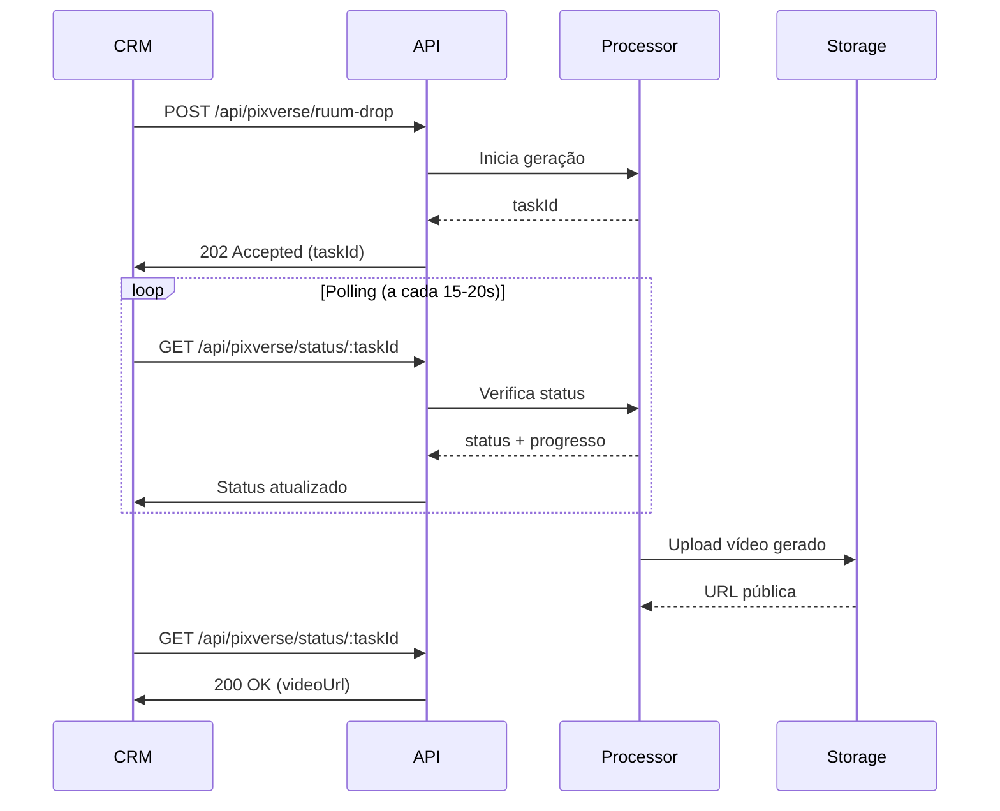

# 🪄 Magic Drop - Animação de Móveis Caindo

> Cria vídeo onde móveis "caem do céu" e compõem o ambiente mobiliado

---

## 📋 Visão Geral

O **Magic Drop** é o efeito mais impactante e criativo:

1. Ambiente vazio é exibido
2. Móveis aparecem "caindo" suavemente do topo
3. Móveis se posicionam naturalmente no lugar
4. Resultado final: ambiente completamente mobiliado

**Efeito Visual:** Semelhante a jogos de decoração/arquitetura

---

## 🎯 Endpoints

### 1️⃣ Iniciar Processamento

```
POST /api/pixverse/ruum-drop
```

**Tipo:** Assíncrono (requer polling)  
**Tempo médio:** 3-8 minutos  
**Timeout inicial:** 30 segundos

### 2️⃣ Verificar Status

```
GET /api/pixverse/status/:taskId
```

**Tipo:** Síncrono (verificação rápida)  
**Polling:** A cada 15-20 segundos

---

## 📨 Request - Iniciar Processamento

### Headers

```
Authorization: Bearer YOUR_API_KEY
Content-Type: application/json
```

### Body Parameters

| Parâmetro | Tipo | Obrigatório | Default | Descrição |
|-----------|------|-------------|---------|-----------|
| `imageEmpty` | string | ✅ | - | URL da imagem do ambiente VAZIO |
| `imageFurnished` | string | ✅ | - | URL da imagem do ambiente MOBILIADO (referência) |
| `prompt` | string | ❌ | Auto-gerado | Descrição da animação desejada |
| `aspectRatio` | string | ❌ | `16:9` | Proporção (`16:9`, `9:16`, `1:1`) |
| `duration` | number | ❌ | `4` | Duração em segundos (4-8) |

### Exemplo de Request

```bash
curl -X POST https://apiruum-562831020087.us-central1.run.app/api/pixverse/ruum-drop \
  -H "Authorization: Bearer YOUR_API_KEY" \
  -H "Content-Type: application/json" \
  -d '{
    "imageEmpty": "https://storage.example.com/empty-living.jpg",
    "imageFurnished": "https://storage.example.com/staged-living.jpg",
    "aspectRatio": "16:9",
    "duration": 5
  }'
```

---

## 📬 Response - Iniciar Processamento

### ✅ Sucesso (202 Accepted)

```json
{
  "success": true,
  "data": {
    "taskId": "pixverse_abc123xyz",
    "status": "processing",
    "estimatedTime": "4-8 minutes",
    "statusUrl": "https://apiruum.../api/pixverse/status/pixverse_abc123xyz",
    "prompt": "Furniture pieces gracefully falling from above and settling into their natural positions in the living room, smooth physics simulation, cinematic lighting",
    "timestamp": "2026-02-02T17:00:00Z"
  },
  "message": "Animação Magic Drop em processamento. Use o endpoint de status para verificar."
}
```

### ❌ Erro (4xx/5xx)

```json
{
  "success": false,
  "error": {
    "code": "MISSING_IMAGES",
    "message": "Ambas as imagens (vazia e mobiliada) são obrigatórias",
    "timestamp": "2026-02-02T17:05:00Z"
  }
}
```

---

## 🔍 Request - Verificar Status

### Endpoint

```
GET /api/pixverse/status/:taskId
```

### Exemplo

```bash
curl -X GET https://apiruum-562831020087.us-central1.run.app/api/pixverse/status/pixverse_abc123xyz \
  -H "Authorization: Bearer YOUR_API_KEY"
```

---

## 📬 Response - Verificar Status

### ⏳ Processando (200 OK)

```json
{
  "success": true,
  "taskId": "pixverse_abc123xyz",
  "status": "processing",
  "progress": 45,
  "message": "Vídeo em processamento (45% concluído)",
  "estimatedTimeRemaining": "3 minutes",
  "timestamp": "2026-02-02T17:03:00Z"
}
```

### ✅ Completo (200 OK)

```json
{
  "success": true,
  "taskId": "pixverse_abc123xyz",
  "status": "completed",
  "data": {
    "videoUrl": "https://storage.googleapis.com/ruum-videos/magic_drop_abc123.mp4",
    "thumbnailUrl": "https://storage.googleapis.com/ruum-videos/thumb_abc123.jpg",
    "metadata": {
      "duration": 5,
      "resolution": "1920x1080",
      "fps": 24,
      "codec": "h264",
      "fileSize": "12.5MB",
      "aspectRatio": "16:9",
      "promptUsed": "Furniture pieces gracefully falling from above...",
      "processingTime": "5m 12s",
      "timestamp": "2026-02-02T17:05:12Z"
    }
  }
}
```

### ❌ Falhou (200 OK)

```json
{
  "success": false,
  "taskId": "pixverse_abc123xyz",
  "status": "failed",
  "error": {
    "code": "GENERATION_FAILED",
    "message": "Video generation failed",
    "details": "As imagens são muito diferentes ou incompatíveis",
    "timestamp": "2026-02-02T17:06:00Z"
  }
}
```

---

## 🎨 Prompts Personalizados

### Prompt Padrão (Auto-gerado)

Quando você não especifica um prompt, o sistema gera automaticamente:

```
Furniture pieces gracefully falling from above and settling into their 
natural positions in the [room_type], smooth physics simulation, 
cinematic lighting, professional interior design
```

### Prompts Customizados por Cômodo

**Sala de Estar:**
```json
{
  "prompt": "Modern furniture elegantly dropping from above: sofa, coffee table, armchairs, decorations settling smoothly into a contemporary living room, realistic physics, soft lighting"
}
```

**Quarto:**
```json
{
  "prompt": "Bedroom furniture gracefully falling: bed, nightstands, wardrobe, cushions landing softly in their perfect positions, dreamy atmosphere, warm lighting"
}
```

**Varanda/Outdoor:**
```json
{
  "prompt": "Outdoor furniture gently descending: lounge chairs, plants, tables settling on the balcony, tropical atmosphere, natural daylight"
}
```

**Cozinha:**
```json
{
  "prompt": "Kitchen elements smoothly falling into place: stools, appliances, utensils, decorative items settling naturally, clean modern aesthetic"
}
```

### 💡 Dicas para Prompts Eficazes:

1. **Mencione os móveis** específicos que devem aparecer
2. **Use "gracefully", "smoothly", "gently"** para movimentos suaves
3. **Adicione atmosfera** (warm lighting, cinematic, etc)
4. **Evite prompts muito longos** (máximo 2-3 frases)
5. **Seja específico** sobre o tipo de ambiente

---

## 💡 Exemplos de Uso

### Exemplo 1: Implementação Completa com Polling

```javascript
const axios = require('axios');

async function createMagicDropVideo(emptyImageUrl, furnishedImageUrl) {
  const API_URL = 'https://apiruum-562831020087.us-central1.run.app';
  const headers = { 'Authorization': `Bearer ${process.env.RUUM_API_KEY}` };
  
  // 1. Inicia processamento
  console.log('🪄 Iniciando Magic Drop...');
  const startResponse = await axios.post(
    `${API_URL}/api/pixverse/ruum-drop`,
    {
      imageEmpty: emptyImageUrl,
      imageFurnished: furnishedImageUrl,
      duration: 5,
      aspectRatio: '16:9'
    },
    { headers }
  );
  
  const { taskId } = startResponse.data.data;
  console.log(`✅ Task iniciada: ${taskId}`);
  
  // 2. Polling até completar
  let attempts = 0;
  const maxAttempts = 50; // ~12 minutos (15s * 50)
  
  while (attempts < maxAttempts) {
    await new Promise(resolve => setTimeout(resolve, 15000)); // 15 segundos
    
    const statusResponse = await axios.get(
      `${API_URL}/api/pixverse/status/${taskId}`,
      { headers }
    );
    
    const { status, data, error, progress } = statusResponse.data;
    
    if (status === 'completed') {
      console.log('✅ Magic Drop gerado:', data.videoUrl);
      return data;
    }
    
    if (status === 'failed') {
      console.error('❌ Falha:', error.message);
      throw new Error(error.message);
    }
    
    console.log(`⏳ Processando... ${progress}% (${attempts + 1}/${maxAttempts})`);
    attempts++;
  }
  
  throw new Error('Timeout: Processamento excedeu 12 minutos');
}

// Uso
createMagicDropVideo(
  'https://example.com/empty-room.jpg',
  'https://example.com/furnished-room.jpg'
)
  .then(video => console.log('Sucesso!', video))
  .catch(err => console.error('Erro:', err));
```

### Exemplo 2: Com Prompt Customizado

```javascript
const response = await axios.post('/api/pixverse/ruum-drop', {
  imageEmpty: 'https://example.com/empty-balcony.jpg',
  imageFurnished: 'https://example.com/staged-balcony.jpg',
  prompt: 'Outdoor lounge furniture and tropical plants gracefully falling from sky, settling on modern balcony, sunny atmosphere, professional staging',
  duration: 6,
  aspectRatio: '16:9'
});
```

### Exemplo 3: Pipeline Completo (Virtual Staging + Magic Drop)

```javascript
async function fullStagingPipeline(emptyRoomUrl) {
  // 1. Gera Virtual Staging
  console.log('🎨 Gerando Virtual Staging...');
  const staging = await axios.post('/api/imagen-staging/full-pipeline', {
    imageUrl: emptyRoomUrl,
    designStyle: 'scandinavian',
    roomType: 'living_room'
  });
  
  const furnishedUrl = staging.data.data.generatedImageUrl;
  console.log('✅ Virtual Staging gerado:', furnishedUrl);
  
  // 2. Gera Magic Drop com as duas imagens
  console.log('🪄 Gerando Magic Drop...');
  const magicDrop = await createMagicDropVideo(emptyRoomUrl, furnishedUrl);
  
  console.log('✅ Magic Drop gerado:', magicDrop.videoUrl);
  
  return {
    stagedImage: furnishedUrl,
    magicDropVideo: magicDrop.videoUrl
  };
}

// Uso
fullStagingPipeline('https://example.com/empty-living.jpg')
  .then(result => console.log('Pipeline completo:', result))
  .catch(err => console.error('Erro:', err));
```

### Exemplo 4: Geração em Lote

```javascript
async function processBatch(pairs) {
  // Processa em lotes de 2 (Magic Drop é pesado)
  const batchSize = 2;
  const results = [];
  
  for (let i = 0; i < pairs.length; i += batchSize) {
    const batch = pairs.slice(i, i + batchSize);
    
    console.log(`📦 Processando lote ${Math.floor(i/batchSize) + 1}...`);
    
    const batchResults = await Promise.all(
      batch.map(pair => 
        createMagicDropVideo(pair.empty, pair.furnished)
      )
    );
    
    results.push(...batchResults);
    console.log(`✅ Lote ${Math.floor(i/batchSize) + 1} completo`);
  }
  
  return results;
}

// Uso
const imagePairs = [
  { empty: 'url1.jpg', furnished: 'url2.jpg' },
  { empty: 'url3.jpg', furnished: 'url4.jpg' },
  { empty: 'url5.jpg', furnished: 'url6.jpg' }
];

processBatch(imagePairs);
```

---

## ⚙️ Configurações e Limites

### Durações Suportadas
- **4 segundos** (mínimo, mais rápido)
- **5-6 segundos** (recomendado, equilíbrio ideal)
- **8 segundos** (máximo, mais dramático)

### Aspect Ratios
- `16:9` - Landscape (YouTube, web) - **RECOMENDADO**
- `9:16` - Portrait (Instagram Stories, TikTok)
- `1:1` - Square (Instagram Feed)

### Limites
- **Tamanho máximo por imagem:** 10MB
- **Resolução mínima:** 1024x1024
- **Resolução máxima:** 4096x4096
- **Concurrent tasks:** 3 por API key (pesado)
- **Timeout:** 15 minutos por vídeo

---

## ⚠️ Limitações e Recomendações

### ✅ Imagens Ideais:

- **Ambiente vazio** com estrutura clara (paredes, janelas, piso)
- **Ambiente mobiliado** com móveis bem definidos
- **Mesmo ângulo** e **mesma iluminação** nas duas fotos
- **Alta resolução** (mínimo 1920x1080)
- **Ambientes simples** funcionam melhor que muito complexos

### ❌ Evite:

- Imagens com ângulos/perspectivas diferentes
- Ambientes muito escuros ou com iluminação drasticamente diferente
- Diferenças estruturais (paredes movidas, etc)
- Móveis muito pequenos ou com muitos detalhes finos
- Imagens de baixa qualidade

### 💡 Dicas de Qualidade:

1. **Use Virtual Staging primeiro** para garantir alinhamento perfeito
2. **Iluminação consistente** é crucial para o efeito
3. **Duração de 5-6s é ideal** para a maioria dos casos
4. **Teste com ambientes simples** antes de complexos
5. **Magic Drop funciona melhor em 16:9** (landscape)

---

## 🎯 Casos de Uso Ideais

### ✅ Excelente Para:

- **Marketing imobiliário impactante** (redes sociais, anúncios)
- **Apresentações de vendas** (wow factor garantido)
- **Tours virtuais** (início do vídeo)
- **Conteúdo viral** (TikTok, Instagram Reels)

### ⚠️ Não Recomendado Para:

- Documentação técnica (use Before/After simples)
- Casos onde realismo extremo é crítico
- Múltiplos vídeos em massa (é mais lento)

---

## 🔄 Fluxo de Integração



**Tempo total:** 3-8 minutos (dependendo da complexidade)

---

## 📊 Métricas de Performance

| Métrica | Valor Médio | P95 | P99 |
|---------|-------------|-----|-----|
| Tempo de processamento (5s) | 5m 20s | 7m 30s | 10m 15s |
| Tempo de processamento (8s) | 7m 10s | 9m 45s | 12m 30s |
| Taxa de sucesso | 89% | - | - |
| Tamanho do arquivo (5s) | 11 MB | 15 MB | 18 MB |

---

## 🐛 Troubleshooting

### Problema: "GENERATION_FAILED - Imagens incompatíveis"
**Causa:** Ângulos ou estruturas muito diferentes entre as imagens  
**Solução:** Use Virtual Staging para gerar a imagem mobiliada a partir da vazia

### Problema: Móveis aparecem distorcidos ou em lugares errados
**Causa:** IA não conseguiu identificar corretamente os móveis  
**Solução:** Use imagens de alta qualidade e prompt mais específico

### Problema: Timeout após 15 minutos
**Causa:** Servidor sobrecarregado ou vídeo muito complexo  
**Solução:** Reduza a duração (4-5s) ou tente novamente mais tarde

### Problema: Movimento muito rápido ou não natural
**Causa:** Prompt inadequado ou duração muito curta  
**Solução:** Use duração de 6s e adicione "gracefully", "smoothly" ao prompt

### Problema: Vídeo com baixa qualidade
**Causa:** Imagens de baixa resolução  
**Solução:** Use imagens com mínimo 1920x1080

---

## 🎬 Comparação: Magic Drop vs Magic Motion

| Característica | Magic Drop | Magic Motion |
|----------------|------------|--------------|
| **Efeito** | Móveis caindo e compondo | Movimento de câmera |
| **Impacto Visual** | ⭐⭐⭐⭐⭐ (muito alto) | ⭐⭐⭐⭐ (alto) |
| **Tempo de Processo** | 3-8 min | 2-5 min |
| **Taxa de Sucesso** | 89% | 94% |
| **Melhor Para** | Marketing viral | Vídeos profissionais |
| **Realismo** | Artístico/criativo | Cinematográfico |
| **Custo Computacional** | Alto | Médio |

**Recomendação:** Use **Magic Drop** quando quiser máximo impacto visual e **Magic Motion** quando precisar de resultados mais rápidos e realistas.

---

## 📚 Referências Relacionadas

- [Quick Start Guide](./QUICKSTART.md) - Implementação básica com polling
- [Virtual Staging](./VIRTUAL_STAGING.md) - Gere a imagem mobiliada primeiro
- [Magic Motion](./VIDEO_MAGIC_MOTION.md) - Alternativa com movimento de câmera
- [Error Codes](./ERROR_CODES.md) - Troubleshooting completo

---

**Dúvidas?** suporte@ruum.com.br
