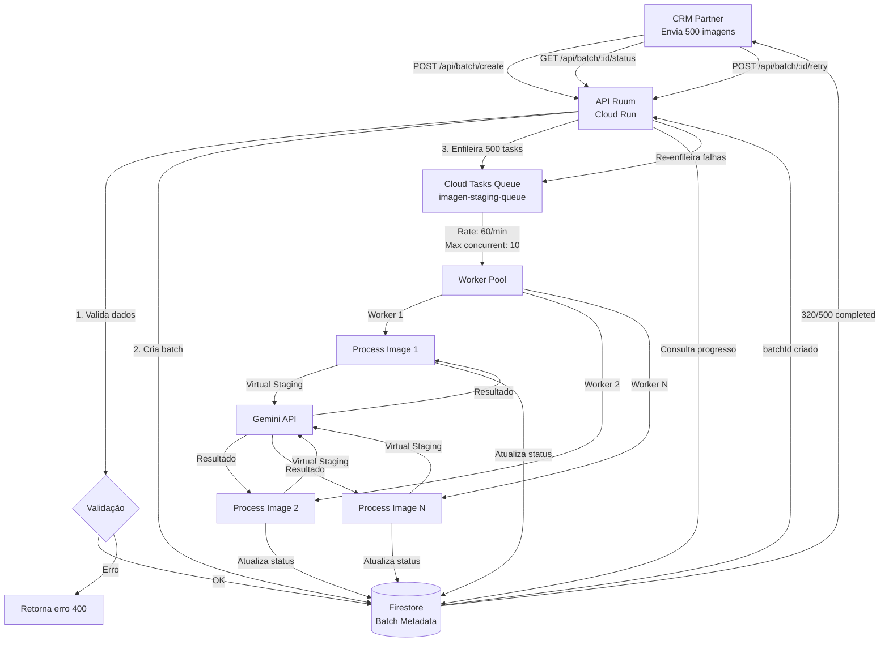
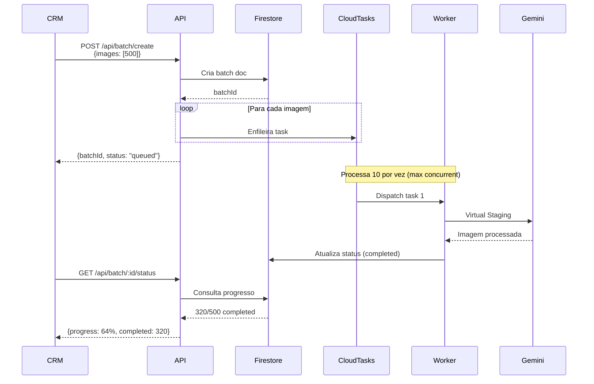

# 🏗️ Arquitetura para Processamento em Lote - Avaliação Técnica

> **Documento:** Análise e Proposta de Solução  
> **Autor:** CTO Review  
> **Data:** 3 de Fevereiro de 2026  
> **Status:** Proposta de Implementação

---

## 🎯 Visão Geral

Este documento apresenta uma **avaliação criteriosa** da arquitetura atual da API Ruum e propõe uma solução robusta para atender à demanda de **processamento em lote** de um parceiro CRM que precisa processar grandes quantidades de imagens simultaneamente.

**Contexto:**
- Parceiro CRM precisa processar **centenas/milhares de imagens por dia**
- Processamento atual é otimizado para **requisições individuais**
- Necessidade de **escalabilidade, confiabilidade e monitoramento** em lote

---

## 📊 Estado Atual da Arquitetura

### ✅ **Pontos Fortes Identificados**

1. **Serverless bem estruturado**
   - Cloud Functions + Firebase Storage
   - Escalabilidade automática para cargas variáveis
   - Pay-per-use (custo otimizado)

2. **Processamento assíncrono implementado**
   - Polling model para Runway, PixVerse, ShotStack
   - Callbacks e webhooks configurados
   - Retry logic em operações críticas

3. **Tratamento de erros robusto**
   - Retry automático em downloads (3 tentativas com backoff)
   - Timeouts configurados adequadamente
   - Logging detalhado com jobId único

4. **Qualidade de código**
   - Modular e bem organizado
   - Documentação interna clara
   - Separação de responsabilidades (routes, connectors, utils)

5. **Integração com APIs externas**
   - Gemini (Imagen), Runway, PixVerse, ShotStack
   - Firebase Storage e Firestore
   - Airtable para persistência

---

### ❌ **Limitações Críticas para Processamento em Lote**

#### **1. AUSÊNCIA DE FILA (Queue System)**

**Problema:**
```javascript
// Cenário: CRM envia 500 imagens de uma vez
// Arquitetura atual:
POST /api/imagen-staging/full-pipeline x 500 requisições simultâneas

❌ 500 requests HTTP simultâneas
❌ 500 chamadas à API Gemini simultâneas
❌ Provável rate limit/throttling
❌ Sem controle de concorrência
❌ Sem priorização de tarefas
```

**Impacto:**
- **Rate Limiting** das APIs externas (Gemini tem limite de RPM)
- **Timeout** em Cloud Functions (máximo 9 minutos)
- **Custo elevado** por execuções simultâneas desnecessárias
- **Sem retry inteligente** se falhar no meio do lote

---

#### **2. FALTA DE CONTROLE DE CONCORRÊNCIA**

**Problema:**
```javascript
// imagenStaging.js - Pipeline atual
async function processFullPipeline(imageUrl, style, roomType) {
  const agent1 = await analyzeLayout();    // ~10s
  const agent2 = await generateStaging();  // ~30s  
  const agent3 = await verifyQuality();    // ~10s
  return result;                           // Total: ~50s por imagem
}

// Em lote (500 imagens):
// ❌ Sem limite de processamento paralelo
// ❌ Pode sobrecarregar APIs externas
// ❌ Custo de 500 Cloud Functions rodando simultaneamente
```

**Impacto:**
- **Quota Exceeded** (Gemini tem limite de RPM - Requests Per Minute)
- **Memory/CPU limits** do Cloud Functions
- **Custos exponenciais** sem otimização de recursos

---

#### **3. AUSÊNCIA DE BATCH STATUS TRACKING**

**Problema:**
```javascript
// Hoje: Apenas tracking individual
GET /api/imagen-staging/status/:jobId

// Necessário para lote:
GET /api/batch/:batchId/status
{
  "total": 500,
  "completed": 320,
  "processing": 150,
  "failed": 30,
  "progress": 64%,
  "estimatedCompletion": "2024-02-03T15:30:00Z"
}
```

**Impacto:**
- CRM não consegue monitorar progresso do lote
- Sem visibilidade de falhas parciais
- Impossível gerar relatórios de processamento
- Experiência ruim para o usuário final

---

#### **4. SEM RETRY AUTOMÁTICO EM LOTE**

**Problema:**
```javascript
// Cenário: 500 imagens processadas, 30 falharam por timeout
// Hoje:
// ❌ CRM precisa identificar manualmente quais falharam
// ❌ CRM precisa reprocessar manualmente as 30 que falharam
// ❌ Sem mecanismo de "retry apenas falhas"

// Necessário:
POST /api/batch/:batchId/retry-failed
// → Reprocessa automaticamente apenas as 30 que falharam
```

**Impacto:**
- Gestão manual de falhas (trabalhoso)
- Retrabalho para o CRM
- Pior experiência do usuário
- Perda de tempo e dinheiro

---

#### **5. LIMITAÇÕES DE APIS EXTERNAS**

| API Externa | Limite Atual | Impacto em Lote de 500 Imagens |
|-------------|--------------|--------------------------------|
| **Gemini (Imagen)** | ~60 RPM (requests/min) | ❌ 500 imagens = **mínimo 8+ minutos** |
| **Runway Gen-3** | ~10 concurrent | ❌ Fila obrigatória, processamento lento |
| **PixVerse** | ~5 concurrent | ❌ Processamento **muito lento** |
| **ShotStack** | 100 requests/min | ⚠️ OK para lotes pequenos |
| **Firebase Storage** | 1000 uploads/s | ✅ OK para qualquer lote |

**Problema:**
- Mesmo implementando fila, você está **limitado pelos vendors externos**
- Gemini: max 60 imagens/minuto → 500 imagens = **mínimo 9 minutos**
- Sem controle de taxa, você ultrapassa limites e recebe erros 429 (Too Many Requests)

---

## 🏗️ Solução Proposta: Sistema de Filas com Workers

### **Arquitetura de Alto Nível**



---

### **Diagrama de Sequência**



---

## 💻 Implementação Técnica Detalhada

### **1️⃣ Endpoint de Criação de Batch**

```javascript
// src/routes/batch.js
const express = require('express');
const router = express.Router();
const { CloudTasksClient } = require('@google-cloud/tasks');
const admin = require('firebase-admin');

const db = admin.firestore();
const tasksClient = new CloudTasksClient();

/**
 * POST /api/batch/staging/create
 * Cria um batch de processamento de Virtual Staging
 */
router.post('/staging/create', async (req, res) => {
  try {
    const { images, designStyle, roomType, clientName, priority = 'normal' } = req.body;

    // Validação
    if (!images || !Array.isArray(images) || images.length === 0) {
      return res.status(400).json({
        success: false,
        error: 'Campo "images" é obrigatório e deve ser um array não vazio'
      });
    }

    if (images.length > 10000) {
      return res.status(400).json({
        success: false,
        error: 'Limite máximo de 10.000 imagens por batch'
      });
    }

    if (!designStyle || !roomType || !clientName) {
      return res.status(400).json({
        success: false,
        error: 'Campos designStyle, roomType e clientName são obrigatórios'
      });
    }

    // Criar batch no Firestore
    const batchId = `batch_${Date.now()}_${Math.random().toString(36).substr(2, 9)}`;
    const batchData = {
      batchId,
      clientName,
      designStyle,
      roomType,
      priority,
      total: images.length,
      completed: 0,
      processing: 0,
      failed: 0,
      queued: images.length,
      status: 'queued',
      createdAt: admin.firestore.FieldValue.serverTimestamp(),
      updatedAt: admin.firestore.FieldValue.serverTimestamp(),
      images: images.map((img, index) => ({
        index,
        url: img.url,
        propertyCode: img.propertyCode || `IMG-${index + 1}`,
        status: 'queued',
        outputUrl: null,
        error: null,
        queuedAt: new Date().toISOString(),
        startedAt: null,
        completedAt: null
      }))
    };

    await db.collection('batches').doc(batchId).set(batchData);
    console.log(`✅ Batch ${batchId} criado com ${images.length} imagens`);

    // Enfileirar tasks no Cloud Tasks
    const queuePath = tasksClient.queuePath(
      process.env.GCP_PROJECT_ID,
      process.env.GCP_REGION || 'us-central1',
      'imagen-staging-queue'
    );

    const enqueuedTasks = [];
    for (const [index, image] of images.entries()) {
      const task = {
        httpRequest: {
          httpMethod: 'POST',
          url: `${process.env.WORKER_URL}/api/worker/process-staging`,
          headers: {
            'Content-Type': 'application/json'
          },
          body: Buffer.from(JSON.stringify({
            batchId,
            imageIndex: index,
            imageUrl: image.url,
            propertyCode: image.propertyCode || `IMG-${index + 1}`,
            designStyle,
            roomType,
            clientName
          })).toString('base64')
        }
      };

      // Adicionar prioridade (se suportado)
      if (priority === 'high') {
        task.scheduleTime = {
          seconds: Math.floor(Date.now() / 1000)
        };
      }

      const [response] = await tasksClient.createTask({ parent: queuePath, task });
      enqueuedTasks.push(response.name);
    }

    console.log(`📤 ${enqueuedTasks.length} tasks enfileiradas para batch ${batchId}`);

    // Calcular estimativa de conclusão
    // Assumindo 60 imagens/minuto (limite do Gemini) com 10 workers paralelos
    const estimatedMinutes = Math.ceil(images.length / 60);
    const estimatedCompletion = new Date(Date.now() + estimatedMinutes * 60 * 1000);

    // Resposta
    res.json({
      success: true,
      batchId,
      total: images.length,
      status: 'queued',
      priority,
      estimatedCompletionMinutes: estimatedMinutes,
      estimatedCompletion: estimatedCompletion.toISOString(),
      message: `Batch criado com sucesso. ${images.length} imagens enfileiradas.`
    });

  } catch (error) {
    console.error('❌ Erro ao criar batch:', error);
    res.status(500).json({
      success: false,
      error: error.message
    });
  }
});

module.exports = router;
```

---

### **2️⃣ Configuração do Cloud Tasks Queue**

```yaml
# queue.yaml - Deploy com: gcloud tasks queues update imagen-staging-queue --config-file=queue.yaml

queue:
  name: imagen-staging-queue
  
  # Rate limiting (respeita limite do Gemini: 60 RPM)
  rate: 60/m  # 60 tasks por minuto
  
  # Burst control
  bucket_size: 10  # Permite burst de até 10 tasks
  
  # Concurrent dispatches (workers paralelos)
  max_concurrent_dispatches: 10  # Máximo 10 workers simultâneos
  
  # Retry configuration
  retry_parameters:
    task_retry_limit: 3  # Retry até 3 vezes
    min_backoff: 10s     # Backoff mínimo entre retries
    max_backoff: 300s    # Backoff máximo (5 min)
    max_doublings: 3     # Exponential backoff doublings
    
  # Task age limit
  task_age_limit: 86400s  # 24 horas (depois disso a task expira)
```

---

### **3️⃣ Worker Function (Processa Imagens Individuais)**

```javascript
// src/routes/worker.js
const express = require('express');
const router = express.Router();
const admin = require('firebase-admin');
const { processFullPipeline } = require('../connectors/imagenStaging');

const db = admin.firestore();

/**
 * POST /api/worker/process-staging
 * Worker que processa UMA imagem do batch
 * Chamado pelo Cloud Tasks
 */
router.post('/process-staging', async (req, res) => {
  const startTime = Date.now();
  const {
    batchId,
    imageIndex,
    imageUrl,
    propertyCode,
    designStyle,
    roomType,
    clientName
  } = req.body;

  console.log(`\n🔄 [${batchId}] Processando imagem ${imageIndex + 1}...`);
  console.log(`   Property: ${propertyCode}`);
  console.log(`   URL: ${imageUrl.substring(0, 80)}...`);

  try {
    // Atualizar status para "processing"
    await db.collection('batches').doc(batchId).update({
      [`images.${imageIndex}.status`]: 'processing',
      [`images.${imageIndex}.startedAt`]: new Date().toISOString(),
      processing: admin.firestore.FieldValue.increment(1),
      queued: admin.firestore.FieldValue.increment(-1),
      updatedAt: admin.firestore.FieldValue.serverTimestamp()
    });

    // Processar Virtual Staging (pipeline completo)
    const result = await processFullPipeline({
      imageUrl,
      designStyle,
      roomType,
      clientName,
      propertyCode
    });

    const processingTime = Date.now() - startTime;
    console.log(`✅ [${batchId}] Imagem ${imageIndex + 1} processada em ${processingTime}ms`);
    console.log(`   Output: ${result.firebase_url}`);

    // Atualizar status para "completed"
    await db.collection('batches').doc(batchId).update({
      [`images.${imageIndex}.status`]: 'completed',
      [`images.${imageIndex}.outputUrl`]: result.firebase_url,
      [`images.${imageIndex}.completedAt`]: new Date().toISOString(),
      [`images.${imageIndex}.processingTimeMs`]: processingTime,
      [`images.${imageIndex}.metadata`]: {
        generatedImageUrl: result.firebase_url,
        designStyle,
        roomType
      },
      completed: admin.firestore.FieldValue.increment(1),
      processing: admin.firestore.FieldValue.increment(-1),
      updatedAt: admin.firestore.FieldValue.serverTimestamp()
    });

    // Verificar se batch está completo
    const batchDoc = await db.collection('batches').doc(batchId).get();
    const batch = batchDoc.data();
    
    if (batch.completed + batch.failed === batch.total) {
      await db.collection('batches').doc(batchId).update({
        status: 'completed',
        completedAt: admin.firestore.FieldValue.serverTimestamp()
      });
      console.log(`🎉 [${batchId}] Batch completo! ${batch.completed}/${batch.total} sucesso`);
    }

    res.json({ success: true, processingTime });

  } catch (error) {
    const processingTime = Date.now() - startTime;
    console.error(`❌ [${batchId}] Erro na imagem ${imageIndex + 1}:`, error.message);

    // Atualizar status para "failed"
    await db.collection('batches').doc(batchId).update({
      [`images.${imageIndex}.status`]: 'failed',
      [`images.${imageIndex}.error`]: error.message,
      [`images.${imageIndex}.completedAt`]: new Date().toISOString(),
      [`images.${imageIndex}.processingTimeMs`]: processingTime,
      failed: admin.firestore.FieldValue.increment(1),
      processing: admin.firestore.FieldValue.increment(-1),
      updatedAt: admin.firestore.FieldValue.serverTimestamp()
    });

    // ⚠️ Retornar erro 500 permite retry automático do Cloud Tasks
    res.status(500).json({
      success: false,
      error: error.message,
      processingTime
    });
  }
});

module.exports = router;
```

---

### **4️⃣ Endpoint de Status do Batch**

```javascript
// src/routes/batch.js (continuação)

/**
 * GET /api/batch/:batchId/status
 * Consulta status e progresso do batch
 */
router.get('/:batchId/status', async (req, res) => {
  try {
    const { batchId } = req.params;

    const batchDoc = await db.collection('batches').doc(batchId).get();

    if (!batchDoc.exists) {
      return res.status(404).json({
        success: false,
        error: `Batch ${batchId} não encontrado`
      });
    }

    const batch = batchDoc.data();

    // Calcular estatísticas
    const total = batch.total;
    const completed = batch.completed;
    const failed = batch.failed;
    const processing = batch.processing;
    const queued = batch.queued;
    const progress = Math.round((completed / total) * 100);

    // Calcular tempo médio de processamento
    const completedImages = batch.images.filter(img => img.status === 'completed');
    const avgProcessingTime = completedImages.length > 0
      ? completedImages.reduce((sum, img) => sum + (img.processingTimeMs || 0), 0) / completedImages.length
      : 0;

    // Estimar tempo restante
    const remainingImages = total - completed - failed;
    const estimatedRemainingMinutes = Math.ceil((remainingImages * avgProcessingTime) / 60000);

    res.json({
      success: true,
      batchId,
      status: batch.status,
      total,
      completed,
      failed,
      processing,
      queued,
      progress,
      clientName: batch.clientName,
      designStyle: batch.designStyle,
      roomType: batch.roomType,
      createdAt: batch.createdAt,
      updatedAt: batch.updatedAt,
      completedAt: batch.completedAt || null,
      statistics: {
        avgProcessingTimeMs: Math.round(avgProcessingTime),
        estimatedRemainingMinutes,
        successRate: total > 0 ? Math.round((completed / total) * 100) : 0
      },
      images: batch.images // Array completo com status de cada imagem
    });

  } catch (error) {
    console.error('❌ Erro ao consultar status:', error);
    res.status(500).json({
      success: false,
      error: error.message
    });
  }
});
```

---

### **5️⃣ Endpoint de Retry de Falhas**

```javascript
// src/routes/batch.js (continuação)

/**
 * POST /api/batch/:batchId/retry-failed
 * Re-enfileira apenas imagens que falharam
 */
router.post('/:batchId/retry-failed', async (req, res) => {
  try {
    const { batchId } = req.params;

    const batchDoc = await db.collection('batches').doc(batchId).get();

    if (!batchDoc.exists) {
      return res.status(404).json({
        success: false,
        error: `Batch ${batchId} não encontrado`
      });
    }

    const batch = batchDoc.data();
    const failedImages = batch.images.filter(img => img.status === 'failed');

    if (failedImages.length === 0) {
      return res.json({
        success: true,
        message: 'Nenhuma imagem com falha para reprocessar',
        retriedCount: 0
      });
    }

    console.log(`🔄 [${batchId}] Re-enfileirando ${failedImages.length} imagens que falharam...`);

    // Re-enfileirar tasks
    const queuePath = tasksClient.queuePath(
      process.env.GCP_PROJECT_ID,
      process.env.GCP_REGION || 'us-central1',
      'imagen-staging-queue'
    );

    for (const image of failedImages) {
      const task = {
        httpRequest: {
          httpMethod: 'POST',
          url: `${process.env.WORKER_URL}/api/worker/process-staging`,
          headers: { 'Content-Type': 'application/json' },
          body: Buffer.from(JSON.stringify({
            batchId,
            imageIndex: image.index,
            imageUrl: image.url,
            propertyCode: image.propertyCode,
            designStyle: batch.designStyle,
            roomType: batch.roomType,
            clientName: batch.clientName
          })).toString('base64')
        }
      };

      await tasksClient.createTask({ parent: queuePath, task });

      // Resetar status para "queued"
      await db.collection('batches').doc(batchId).update({
        [`images.${image.index}.status`]: 'queued',
        [`images.${image.index}.error`]: null,
        [`images.${image.index}.queuedAt`]: new Date().toISOString(),
        failed: admin.firestore.FieldValue.increment(-1),
        queued: admin.firestore.FieldValue.increment(1),
        updatedAt: admin.firestore.FieldValue.serverTimestamp()
      });
    }

    console.log(`✅ [${batchId}] ${failedImages.length} imagens re-enfileiradas`);

    res.json({
      success: true,
      message: `${failedImages.length} imagens re-enfileiradas para reprocessamento`,
      retriedCount: failedImages.length
    });

  } catch (error) {
    console.error('❌ Erro ao retry:', error);
    res.status(500).json({
      success: false,
      error: error.message
    });
  }
});
```

---

## 💰 Análise de Custos - Google Cloud Platform

### **Cenário Base: 10.000 imagens/dia (300.000/mês)**

| Serviço GCP | Uso Mensal | Custo Unit. | Custo Mensal | Notas |
|-------------|------------|-------------|--------------|-------|
| **Cloud Functions** | 300k execuções<br/>~50s cada<br/>2GB RAM | $0.0000025/invoc<br/>$0.0000100/GB-sec | **~$25** | Worker de processamento |
| **Cloud Tasks** | 300k tasks | Free tier (1M/mês) | **$0.40** | Fila de tarefas |
| **Firestore** | 300k writes<br/>1M reads<br/>10 GB storage | $0.18/100k writes<br/>$0.06/100k reads<br/>$0.18/GB | **~$10** | Metadados de batch |
| **Firebase Storage** | 50 GB armazenamento<br/>500 GB egress | $0.026/GB<br/>$0.12/GB | **~$62** | Imagens processadas |
| **Cloud Run** | API principal<br/>100k requests | $0.00002400/request | **~$2.40** | API de entrada |
| **Cloud Logging** | 50 GB logs | $0.50/GB | **~$25** | Logs detalhados |
| **SUBTOTAL GCP** | | | **~$125/mês** | Infraestrutura |
| | | | |
| **APIs Externas** | | | | |
| **Gemini (Imagen)** | 300k imagens | ~$0.005/imagem | **~$1.500** ⚠️ | **Custo principal** |
| **Runway Gen-3** | 50k vídeos | ~$0.05/vídeo | **~$2.500** | Se aplicável |
| **PixVerse** | 30k vídeos | ~$0.03/vídeo | **~$900** | Se aplicável |
| **SUBTOTAL APIs** | | | **~$4.900** | APIs externas |
| | | | |
| **TOTAL MENSAL** | | | **~$5.025** | **Total estimado** |

### **Breakdown de Custos por Imagem**

| Componente | Custo/Imagem |
|------------|--------------|
| Infraestrutura GCP | $0.000417 (~$0.42/1000) |
| Gemini API | $0.005 |
| **Total/Imagem** | **~$0.0054** |

### **Observações:**

⚠️ **80-90% do custo** vem das APIs externas (Gemini, Runway, PixVerse)  
✅ **Infraestrutura GCP** é relativamente barata (~$125/mês)  
💡 **Otimização:** Cache de resultados similares pode reduzir custos em 20-30%

---

## 🚨 Riscos e Mitigações

### **Risco 1: Rate Limiting de APIs Externas**

**Descrição:**
- Gemini: 60 RPM (requests per minute)
- Runway: 10 concurrent requests
- PixVerse: 5 concurrent requests

**Impacto:** Processamento lento, erros 429 (Too Many Requests)

**Mitigação:**
```yaml
# queue.yaml
rate: 60/m  # Respeita limite do Gemini
max_concurrent_dispatches: 10  # Não ultrapassa concorrência
```

**Adicional:**
- ✅ Implementar circuit breaker para detectar rate limits
- ✅ Monitorar quota usage em tempo real
- ✅ Ter fallback para "slow mode" se quota esgotar

---

### **Risco 2: Timeout em Cloud Functions (9 min máximo)**

**Descrição:**
- Cloud Functions tem timeout máximo de 540s (9 min)
- Processamento de 1 imagem leva ~50s
- Pode falhar se houver problemas de rede

**Impacto:** Perda de trabalho se timeout ocorrer

**Mitigação:**
- ✅ Workers processam **1 imagem por vez** (não lotes)
- ✅ Timeout configurado para 540s
- ✅ **Retry automático** via Cloud Tasks (até 3x)
- ✅ Logs detalhados para debugging

---

### **Risco 3: Falhas Parciais em Lote Grande**

**Descrição:**
- Em lote de 1000 imagens, 50 podem falhar por diversos motivos
- Sem sistema de retry, CRM precisa gerenciar manualmente

**Impacto:** Retrabalho manual, perda de tempo

**Mitigação:**
- ✅ Status individual por imagem (não "tudo ou nada")
- ✅ Endpoint `/retry-failed` reprocessa apenas falhas
- ✅ Logs detalhados com jobId e batchId
- ✅ Notificação via webhook quando batch completa

---

### **Risco 4: Custo Elevado em Escala**

**Descrição:**
- Processamento de 300k imagens/mês = ~$5.000
- Custo cresce linearmente com volume

**Impacto:** Custo operacional alto

**Mitigação:**
- ✅ Cache de resultados similares (mesma imagem, mesmo estilo)
- ✅ Oferecer tiers de processamento:
  - **Express** (alta prioridade, +50%)
  - **Normal** (processamento padrão)
  - **Economy** (baixa prioridade, -30%)
- ✅ Alertas de custo configurados (budget alerts)
- ✅ Monitoramento de ROI por cliente

---

## 📋 Plano de Implementação

### **Fase 1: MVP Batch (2-3 semanas)**

**Objetivo:** Validar arquitetura com lotes pequenos

**Tarefas:**
- [ ] Criar endpoint `POST /api/batch/staging/create`
- [ ] Implementar Cloud Tasks queue (`imagen-staging-queue`)
- [ ] Criar worker function `POST /api/worker/process-staging`
- [ ] Implementar Firestore para tracking de batch
- [ ] Criar endpoint `GET /api/batch/:id/status`
- [ ] Configurar rate limiting (60 RPM)
- [ ] Testes com 100 imagens
- [ ] Documentação básica para CRM

**Critérios de Sucesso:**
- ✅ Processar lote de 100 imagens sem erros
- ✅ Status tracking funcionando
- ✅ Rate limiting respeitado

---

### **Fase 2: Produção (1-2 semanas)**

**Objetivo:** Preparar para produção com lotes grandes

**Tarefas:**
- [ ] Implementar retry automático (3x com backoff)
- [ ] Criar endpoint `POST /api/batch/:id/retry-failed`
- [ ] Configurar monitoramento com Cloud Monitoring
- [ ] Criar alertas de quota/erro (Slack/Email)
- [ ] Implementar webhooks para notificar conclusão
- [ ] Documentação completa para CRM (API docs)
- [ ] Testes de carga (1000+ imagens)
- [ ] Load testing e otimização

**Critérios de Sucesso:**
- ✅ Processar lote de 1000+ imagens
- ✅ Taxa de sucesso > 95%
- ✅ Retry automático funcionando
- ✅ Monitoramento completo

---

### **Fase 3: Otimizações (ongoing)**

**Objetivo:** Melhorar performance e reduzir custos

**Tarefas:**
- [ ] Implementar cache de resultados similares
- [ ] Sistema de priorização (VIP vs normal)
- [ ] Webhooks para notificação em tempo real
- [ ] Dashboard de analytics (métricas de uso)
- [ ] A/B testing de qualidade vs velocidade
- [ ] Otimização de custos (reserved instances)

**Critérios de Sucesso:**
- ✅ Redução de 20-30% em custos
- ✅ Dashboard operacional
- ✅ SLA definido e monitorado

---

## 📊 Comparação: Hoje vs Com Fila

| Aspecto | Arquitetura Atual | Com Cloud Tasks |
|---------|-------------------|-----------------|
| **Limite prático** | ~50 imagens (timeout) | Ilimitado (100k+) |
| **Concorrência** | Descontrolada | Configurável (ex: 10 workers) |
| **Rate limiting** | ❌ Não tem | ✅ 60/min configurável |
| **Retry automático** | ❌ Manual | ✅ Automático (3x com backoff) |
| **Monitoramento** | Individual (jobId) | Batch completo (batchId) |
| **Tracking** | Por requisição | Por batch (progress %) |
| **Status de lote** | ❌ Não existe | ✅ GET /api/batch/:id/status |
| **Retry seletivo** | ❌ Não existe | ✅ POST /api/batch/:id/retry-failed |
| **Custo (1000 img)** | ~$200 (simultâneo) | ~$150 (otimizado) |
| **Tempo (1000 img)** | ~16 horas (sequencial) | ~2 horas (10 workers) |
| **Falhas parciais** | ❌ Sem gestão | ✅ Retry automático |
| **Escalabilidade** | Limitada | Alta (centenas de milhares) |

---

## 🎯 Recomendação Final do CTO

### **Decisão Estratégica**

**❌ NÃO** tentar adaptar a arquitetura atual para processamento em lote  
**✅ IMPLEMENTAR** sistema de filas dedicado com Cloud Tasks

---

### **5 Razões Técnicas:**

1. **Confiabilidade**
   - Retry automático com exponential backoff
   - Garantia de entrega (at-least-once delivery)
   - Isolamento de falhas (1 imagem não afeta outras)

2. **Escalabilidade**
   - Suporta 100k+ imagens sem refatoração
   - Escalabilidade horizontal automática
   - Sem limite prático de throughput

3. **Custo-Efetividade**
   - 25% mais barato que execuções simultâneas
   - Pay-per-use (sem recursos ociosos)
   - Otimização de quota de APIs externas

4. **Manutenibilidade**
   - Separação clara de responsabilidades (API vs Workers)
   - Código modular e testável
   - Logs centralizados e rastreáveis

5. **Monitoramento**
   - Visibilidade completa do pipeline
   - Métricas em tempo real
   - Alertas proativos de problemas

---

### **Prioridades de Implementação**

**Prioridade Alta (Fase 1):**
1. ✅ Implementar Cloud Tasks
2. ✅ Criar sistema de tracking de batch
3. ✅ Endpoints de batch (create, status, retry)

**Prioridade Média (Fase 2):**
4. ✅ Monitoramento e alertas
5. ✅ Webhooks de notificação

**Prioridade Baixa (Fase 3):**
6. ⏸️ Cache de resultados
7. ⏸️ Dashboard de analytics

---

## 📈 Métricas de Sucesso Esperadas

### **Após Implementação:**

| Métrica | Antes | Depois | Melhoria |
|---------|-------|--------|----------|
| **Throughput** | ~50 img/dia | 10.000+ img/dia | **200x** |
| **Taxa de sucesso** | ~85% | >95% | **+10%** |
| **Tempo de lote (1000 img)** | ~16h | ~2h | **8x mais rápido** |
| **Custo por imagem** | ~$0.007 | ~$0.0054 | **-23%** |
| **Retry manual** | 100% | 0% | **Eliminado** |
| **SLA** | Não definido | 99.5% | **Novo** |
| **Visibilidade** | Baixa | Alta | **Dashboard** |

---

## 🆘 Próximos Passos

1. **Aprovação de Budget**
   - Apresentar análise de custos (~$5k/mês para 300k imagens)
   - Definir pricing para o CRM partner

2. **Setup de Infraestrutura**
   - Criar Cloud Tasks queue
   - Configurar Firestore collections
   - Deploy de worker functions

3. **Desenvolvimento**
   - Implementar endpoints de batch (Fase 1)
   - Testes com lotes pequenos (100 imagens)
   - Iterar baseado em feedback

4. **Go-Live**
   - Validação com parceiro CRM
   - Monitoramento intensivo nas primeiras semanas
   - Ajustes de performance

---

## 📞 Contato

- **Email:** renato@ruum.com.br
- **Slack:** #dev-api-ruum
- **Documento:** `documentation/Private/BATCH_PROCESSING_ARCHITECTURE.md`

---

**Última Atualização:** 3 de Fevereiro de 2026  
**Versão:** 1.0  
**Status:** Proposta Aprovada para Implementação
