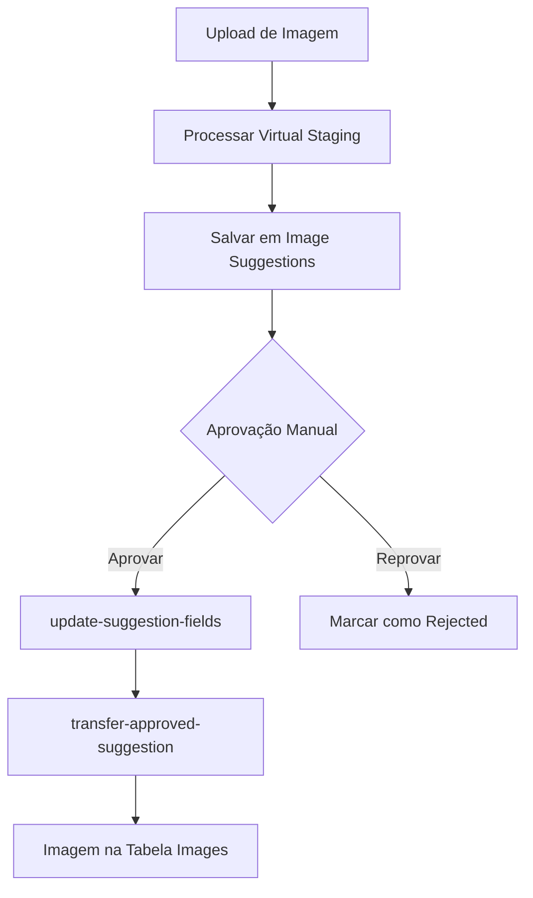

# 📋 Image Suggestions API - Sistema de Sugestões e Aprovação

> **Endpoint Base:** `/api`  
> **Métodos:** POST  
> **Tipo:** Síncrono  
> **Tempo de Resposta:** 1-3 segundos

---

## 📋 Visão Geral

A API de Image Suggestions gerencia o fluxo de curadoria e aprovação de imagens para Virtual Staging. O processo funciona assim:

**Fluxo completo:**
1. **Time Ruum analisa** a base de imóveis do cliente
2. **Time Ruum identifica** imóveis com ambientes vazios (não mobiliados)
3. **Time Ruum seleciona** imagens com bom potencial e cria "sugestões"
4. **Cliente recebe** as sugestões e aprova/rejeita cada uma
5. **Imagens aprovadas** passam automaticamente por Virtual Staging

**Casos de uso:**
- Time Ruum cria sugestões de imagens para Virtual Staging
- Cliente aprova/reprova lotes de sugestões
- Sistema transfere sugestões aprovadas para processamento
- Rastreamento completo do workflow de curadoria

⚠️ **Nota:** Este é um processo de **pré-aprovação de curadoria** (Time Ruum → Cliente). Diferente da aprovação final de imagens processadas ([AIRTABLE_APPROVAL.md](./AIRTABLE_APPROVAL.md)).

---

## 🔗 Endpoints Disponíveis

### 1. Criar Sugestões (Time Ruum)

```
POST /api/update-images-airtable
```

### 2. Aprovar/Rejeitar Sugestões (Cliente)

```
POST /api/update-suggestion-fields
```

### 3. Processar Sugestão Aprovada

```
POST /api/transfer-approved-suggestion
```

---

## 📊 Criar Sugestões de Imagens

### Endpoint:

```
POST /api/update-images-airtable
```

**Uso:** Endpoint utilizado pelo **time Ruum** para cadastrar sugestões de imagens que foram selecionadas na base do cliente como boas candidatas para Virtual Staging.

### Requisição (JSON):

| Campo | Tipo | Obrigatório | Descrição |
|-------|------|-------------|-----------|
| `imagesArray` | array | ✅ | Array de objetos de imagens |
| `email` | string | ❌ | Email do cliente |
| `clientId` | string | ❌ | ID do cliente no Airtable |
| `invoiceId` | string | ❌ | ID da fatura |
| `userId` | string | ❌ | ID do usuário |
| `table` | string | ❌ | Nome da tabela de destino ("Images" ou "Videos") |
| `processMode` | string | ❌ | Modo de processamento |
| `source` | string | ❌ | Origem da requisição |

### Estrutura de cada item em `imagesArray`:

| Campo | Tipo | Descrição |
|-------|------|-----------|
| `imgUrl` | string | URL da imagem (input ou output) |
| `imgWorkflow` | string | Workflow usado (ex: "VirtualStaging", "MagicMotion") |
| `propertyCode` | string | Código do imóvel |
| `roomType` | string | Tipo de cômodo |
| `designStyle` | string | Estilo de design |
| `qualityScore` | number | Score de qualidade (0-100) |

### Exemplo com cURL:

```bash
curl -X POST https://apiruum-562831020087.us-central1.run.app/api/update-images-airtable \
  -H "Content-Type: application/json" \
  -d '{
    "imagesArray": [
      {
        "imgUrl": "https://storage.googleapis.com/.../image1.jpg",
        "imgWorkflow": "VirtualStaging",
        "propertyCode": "IMO-001",
        "roomType": "living_room",
        "designStyle": "modern",
        "qualityScore": 95
      },
      {
        "imgUrl": "https://storage.googleapis.com/.../image2.jpg",
        "imgWorkflow": "VirtualStaging",
        "propertyCode": "IMO-001",
        "roomType": "bedroom",
        "designStyle": "scandinavian",
        "qualityScore": 92
      }
    ],
    "clientId": "recABC123DEF456GHI",
    "email": "cliente@example.com",
    "table": "Images"
  }'
```

### Exemplo com JavaScript:

```javascript
async function saveImagesToAirtable(images, clientData) {
  const response = await fetch(
    'https://apiruum-562831020087.us-central1.run.app/api/update-images-airtable',
    {
      method: 'POST',
      headers: { 'Content-Type': 'application/json' },
      body: JSON.stringify({
        imagesArray: images.map(img => ({
          imgUrl: img.url,
          imgWorkflow: 'VirtualStaging',
          propertyCode: img.propertyCode,
          roomType: img.roomType,
          designStyle: img.style,
          qualityScore: img.score
        })),
        clientId: clientData.id,
        email: clientData.email,
        table: 'Images'
      })
    }
  );
  
  return await response.json();
}
```

### Resposta de Sucesso (200):

```json
{
  "success": true,
  "message": "2 images processed successfully, 0 errors",
  "results": [
    {
      "status": "created",
      "imgUrl": "https://storage.googleapis.com/.../image1.jpg",
      "recordId": "recXYZ123ABC456DEF"
    },
    {
      "status": "created",
      "imgUrl": "https://storage.googleapis.com/.../image2.jpg",
      "recordId": "recXYZ789GHI012JKL"
    }
  ],
  "summary": {
    "total": 2,
    "successful": 2,
    "errors": 0
  }
}
```

---

## ✅ Aprovar/Rejeitar Sugestões (Cliente)

### Endpoint:

```
POST /api/update-suggestion-fields
```

**Uso:** Endpoint utilizado pelo **cliente** para aprovar ou rejeitar em lote as sugestões criadas pelo time Ruum.

### Requisição (JSON):

| Campo | Tipo | Obrigatório | Descrição |
|-------|------|-------------|-----------|
| `suggestionIds` | array | ✅ | Array de IDs de sugestões do Airtable |
| `status` | string | ❌ | Novo status (padrão: "Approved") |

### Valores comuns para `status`:

| Status | Descrição |
|--------|-----------|
| `Approved` | Sugestão aprovada (padrão) |
| `Rejected` | Sugestão reprovada |
| `Pending` | Aguardando revisão |
| `Processing` | Em processamento |

### Exemplo com cURL:

```bash
curl -X POST https://apiruum-562831020087.us-central1.run.app/api/update-suggestion-fields \
  -H "Content-Type: application/json" \
  -d '{
    "suggestionIds": [
      "recSUG123ABC456DEF",
      "recSUG789GHI012JKL",
      "recSUG345MNO678PQR"
    ],
    "status": "Approved"
  }'
```

### Exemplo com JavaScript:

```javascript
async function approveSuggestions(suggestionIds) {
  const response = await fetch(
    'https://apiruum-562831020087.us-central1.run.app/api/update-suggestion-fields',
    {
      method: 'POST',
      headers: { 'Content-Type': 'application/json' },
      body: JSON.stringify({
        suggestionIds: suggestionIds,
        status: 'Approved'
      })
    }
  );
  
  const result = await response.json();
  console.log(`${result.data.updated} sugestões aprovadas`);
  
  return result;
}
```

### Resposta de Sucesso (200):

```json
{
  "success": true,
  "message": "3 suggestions updated successfully, 0 errors",
  "data": {
    "updated": 3,
    "errors": 0,
    "total": 3,
    "details": [
      {
        "id": "recSUG123ABC456DEF",
        "status": "success",
        "message": "Status atualizado para Approved"
      },
      {
        "id": "recSUG789GHI012JKL",
        "status": "success",
        "message": "Status atualizado para Approved"
      },
      {
        "id": "recSUG345MNO678PQR",
        "status": "success",
        "message": "Status atualizado para Approved"
      }
    ]
  }
}
```

### Resposta com Erros Parciais (200):

```json
{
  "success": true,
  "message": "2 suggestions updated successfully, 1 errors",
  "data": {
    "updated": 2,
    "errors": 1,
    "total": 3,
    "details": [
      {
        "id": "recSUG123ABC456DEF",
        "status": "success",
        "message": "Status atualizado para Approved"
      },
      {
        "id": "recINVALID123",
        "status": "error",
        "message": "Record not found"
      },
      {
        "id": "recSUG345MNO678PQR",
        "status": "success",
        "message": "Status atualizado para Approved"
      }
    ]
  }
}
```

---

## 🔄 Processar Sugestão Aprovada

### Endpoint:

```
POST /api/transfer-approved-suggestion
```

### Descrição:

Após o cliente aprovar uma sugestão, este endpoint transfere os dados da tabela "Image suggestions" para a tabela "Images", criando **um registro individual para cada imagem**. As imagens aprovadas entram então na fila de processamento para Virtual Staging.

### Requisição (JSON):

| Campo | Tipo | Obrigatório | Descrição |
|-------|------|-------------|-----------|
| `suggestionData` | object | ✅ | Dados da sugestão aprovada |
| `customEmail` | string | ❌ | Email do cliente |
| `customClientId` | string | ❌ | ID do cliente |
| `customInvoiceId` | string | ❌ | ID da fatura |
| `customUserId` | string | ❌ | ID do usuário |

### Estrutura de `suggestionData`:

| Campo | Tipo | Descrição |
|-------|------|-----------|
| `inputImages` | array | Array de URLs das imagens de entrada |
| `outputImages` | array | Array de URLs das imagens processadas (opcional) |
| `codigo` | string | Código do imóvel |
| `observacoes` | string | Observações/descrição |
| `propertyUrl` | string | URL do imóvel (opcional) |

### Exemplo com cURL:

```bash
curl -X POST https://apiruum-562831020087.us-central1.run.app/api/transfer-approved-suggestion \
  -H "Content-Type: application/json" \
  -d '{
    "suggestionData": {
      "inputImages": [
        "https://example.com/original1.jpg",
        "https://example.com/original2.jpg",
        "https://example.com/original3.jpg"
      ],
      "outputImages": [
        "https://storage.googleapis.com/processed1.jpg",
        "https://storage.googleapis.com/processed2.jpg",
        "https://storage.googleapis.com/processed3.jpg"
      ],
      "codigo": "IMO-2026-001",
      "observacoes": "Virtual Staging - Sala e Quartos",
      "propertyUrl": "https://meusite.com/imovel/IMO-2026-001"
    },
    "customClientId": "recABC123DEF456GHI",
    "customEmail": "cliente@example.com"
  }'
```

### Exemplo com JavaScript:

```javascript
async function transferApprovedSuggestion(suggestion, clientData) {
  const response = await fetch(
    'https://apiruum-562831020087.us-central1.run.app/api/transfer-approved-suggestion',
    {
      method: 'POST',
      headers: { 'Content-Type': 'application/json' },
      body: JSON.stringify({
        suggestionData: {
          inputImages: suggestion.originalImages,
          outputImages: suggestion.processedImages,
          codigo: suggestion.propertyCode,
          observacoes: suggestion.notes,
          propertyUrl: suggestion.url
        },
        customClientId: clientData.id,
        customEmail: clientData.email,
        customUserId: clientData.userId,
        customInvoiceId: clientData.invoiceId
      })
    }
  );
  
  const result = await response.json();
  
  console.log(`✅ ${result.created} imagens transferidas`);
  console.log(`❌ ${result.errors} erros`);
  
  return result;
}
```

### Resposta de Sucesso (200):

```json
{
  "success": true,
  "created": 3,
  "errors": 0,
  "message": "Transferência realizada com sucesso",
  "details": [
    {
      "status": "created",
      "imgUrl": "https://example.com/original1.jpg",
      "recordId": "recIMG123ABC456DEF"
    },
    {
      "status": "created",
      "imgUrl": "https://example.com/original2.jpg",
      "recordId": "recIMG789GHI012JKL"
    },
    {
      "status": "created",
      "imgUrl": "https://example.com/original3.jpg",
      "recordId": "recIMG345MNO678PQR"
    }
  ]
}
```

**Como funciona:**
- A API cria **1 registro na tabela Images para cada URL** no array `inputImages`
- Se houver `outputImages`, cada registro terá tanto `input_img` quanto `output_img`
- Todos os registros compartilham o mesmo `property_code` (código do imóvel)

---

## ⚠️ Códigos de Erro

### 400 - Invalid Array

**Causa:** `imagesArray` não é um array ou está vazio

```json
{
  "success": false,
  "message": "Body must be a non-empty array of images"
}
```

**Solução:** Envie um array válido com pelo menos uma imagem

---

### 400 - Missing Suggestion IDs

**Causa:** Campo `suggestionIds` ausente ou inválido

```json
{
  "success": false,
  "message": "suggestionIds must be an array of suggestion IDs"
}
```

**Solução:** Forneça um array válido de IDs do Airtable

---

### 400 - Empty Suggestion IDs

**Causa:** Array `suggestionIds` está vazio

```json
{
  "success": false,
  "message": "suggestionIds array cannot be empty"
}
```

**Solução:** Inclua pelo menos um ID no array

---

### 400 - Missing Suggestion Data

**Causa:** Campo `suggestionData` não fornecido

```json
{
  "success": false,
  "message": "suggestionData é obrigatório"
}
```

**Solução:** Inclua o objeto `suggestionData` com as informações da sugestão

---

### 400 - Invalid Input Images

**Causa:** `suggestionData.inputImages` está vazio ou inválido

```json
{
  "success": false,
  "message": "suggestionData.inputImages deve ser um array não vazio"
}
```

**Solução:** Forneça um array com pelo menos uma URL de imagem

---

### 500 - Internal Server Error

**Causa:** Erro no Airtable ou processamento interno

```json
{
  "success": false,
  "message": "Internal Server Error",
  "error": "Detailed error message"
}
```

**Solução:** Verifique os dados enviados e tente novamente. Se persistir, contate o suporte.

---

## 💡 Exemplos de Uso Completos

### Exemplo 1: Fluxo Completo de Curadoria e Aprovação

```javascript
// CENÁRIO: Time Ruum encontrou 5 imóveis vazios na base do cliente
// e selecionou imagens boas para Virtual Staging

// ============================================
// PASSO 1: Time Ruum cria sugestões
// ============================================
async function ruumTeamCreatesSuggestions(selectedImages) {
  const response = await fetch(
    'https://apiruum-562831020087.us-central1.run.app/api/update-images-airtable',
    {
      method: 'POST',
      headers: { 'Content-Type': 'application/json' },
      body: JSON.stringify({
        imagesArray: selectedImages.map(img => ({
          imgUrl: img.url,
          imgWorkflow: 'VirtualStaging',
          propertyCode: img.propertyCode,
          roomType: img.roomType,
          designStyle: 'modern',
          qualityScore: img.score
        })),
        clientId: 'recCLIENT123',
        table: 'Image suggestions'
      })
    }
  );
  
  const result = await response.json();
  console.log('✅ Time Ruum criou', result.results.length, 'sugestões');
  
  return result.results.map(r => r.recordId);
}

// ============================================
// PASSO 2: Cliente aprova sugestões
// ============================================
async function clientApprovesSuggestions(suggestionIds) {
  const response = await fetch(
    'https://apiruum-562831020087.us-central1.run.app/api/update-suggestion-fields',
    {
      method: 'POST',
      headers: { 'Content-Type': 'application/json' },
      body: JSON.stringify({
        suggestionIds: suggestionIds,
        status: 'Approved'
      })
    }
  );
  
  const result = await response.json();
  console.log('✅ Cliente aprovou', result.data.updated, 'sugestões');
  
  return result;
}

// ============================================
// PASSO 3: Transferir para processamento
// ============================================
async function processApprovedSuggestions(suggestionIds) {
  const results = [];
  
  for (const suggestionId of suggestionIds) {
    // Buscar dados da sugestão
    const suggestionData = await getSuggestionData(suggestionId);
    
    // Transferir para Images (entra na fila de Virtual Staging)
    const transferResponse = await fetch(
      'https://apiruum-562831020087.us-central1.run.app/api/transfer-approved-suggestion',
      {
        method: 'POST',
        headers: { 'Content-Type': 'application/json' },
        body: JSON.stringify({ suggestionData })
      }
    );
    
    results.push(await transferResponse.json());
  }
  
  console.log('✅ Sugestões transferidas para Virtual Staging');
  return results;
}

// ============================================
// FLUXO COMPLETO
// ============================================
async function fullCurationWorkflow() {
  // 1. Time Ruum analisa base do cliente
  const emptyProperties = await analyzeClientProperties();
  
  // 2. Time Ruum seleciona imagens boas
  const selectedImages = emptyProperties.filter(img => img.score > 85);
  
  // 3. Time Ruum cria sugestões
  const suggestionIds = await ruumTeamCreatesSuggestions(selectedImages);
  
  // 4. Cliente recebe notificação (implementar)
  await notifyClient(suggestionIds);
  
  // 5. Cliente aprova sugestões
  await clientApprovesSuggestions(suggestionIds);
  
  // 6. Sistema processa sugestões aprovadas
  await processApprovedSuggestions(suggestionIds);
  
  console.log('🎉 Workflow completo: Curadoria → Aprovação → Virtual Staging');
}
```

### Exemplo 2: Aprovação em Lote pelo Cliente

```javascript
async function batchApprovalWorkflow(suggestionIds) {
  // PASSO 1: Atualizar status para "Approved"
  const updateResponse = await fetch(
    'https://apiruum-562831020087.us-central1.run.app/api/update-suggestion-fields',
    {
      method: 'POST',
      headers: { 'Content-Type': 'application/json' },
      body: JSON.stringify({
        suggestionIds: suggestionIds,
        status: 'Approved'
      })
    }
  );
  
  const updateResult = await updateResponse.json();
  console.log(`${updateResult.data.updated} sugestões aprovadas`);
  
  // PASSO 2: Para cada sugestão, buscar dados e transferir
  const transferResults = [];
  
  for (const suggestionId of suggestionIds) {
    // Buscar dados da sugestão (implementar busca no Airtable)
    const suggestionData = await getSuggestionData(suggestionId);
    
    // Transferir para tabela Images
    const transferResponse = await fetch(
      'https://apiruum-562831020087.us-central1.run.app/api/transfer-approved-suggestion',
      {
        method: 'POST',
        headers: { 'Content-Type': 'application/json' },
        body: JSON.stringify({
          suggestionData: suggestionData,
          customClientId: 'recABC123DEF456GHI',
          customEmail: 'cliente@example.com'
        })
      }
    );
    
    const transferResult = await transferResponse.json();
    transferResults.push(transferResult);
  }
  
  return {
    approved: updateResult.data.updated,
    transferred: transferResults.reduce((sum, r) => sum + r.created, 0)
  };
}
```

### Exemplo 2: Processar e Salvar Imagens

```javascript
async function processAndSave(imageUrls, propertyCode, clientId) {
  // Processar imagens com Virtual Staging (exemplo)
  const processedImages = [];
  
  for (const imageUrl of imageUrls) {
    const response = await fetch(
      'https://apiruum-562831020087.us-central1.run.app/api/imagen-staging/full-pipeline',
      {
        method: 'POST',
        headers: { 'Content-Type': 'application/json' },
        body: JSON.stringify({
          imageUrl: imageUrl,
          designStyle: 'modern',
          roomType: 'living_room'
        })
      }
    );
    
    const result = await response.json();
    
    if (result.success) {
      processedImages.push({
        imgUrl: result.generatedImageUrl,
        imgWorkflow: 'VirtualStaging',
        propertyCode: propertyCode,
        roomType: 'living_room',
        designStyle: 'modern',
        qualityScore: result.qualityScore || 90
      });
    }
  }
  
  // Salvar no Airtable
  const saveResponse = await fetch(
    'https://apiruum-562831020087.us-central1.run.app/api/update-images-airtable',
    {
      method: 'POST',
      headers: { 'Content-Type': 'application/json' },
      body: JSON.stringify({
        imagesArray: processedImages,
        clientId: clientId,
        table: 'Images'
      })
    }
  );
  
  return await saveResponse.json();
}
```

### Exemplo 3: Transferência Automática de Sugestões Aprovadas

```javascript
async function autoTransferApproved(clientData) {
  // Buscar todas as sugestões com status "Approved"
  // (implementar busca no Airtable)
  const approvedSuggestions = await getApprovedSuggestions();
  
  console.log(`Encontradas ${approvedSuggestions.length} sugestões aprovadas`);
  
  const results = {
    transferred: 0,
    errors: 0,
    details: []
  };
  
  for (const suggestion of approvedSuggestions) {
    try {
      const response = await fetch(
        'https://apiruum-562831020087.us-central1.run.app/api/transfer-approved-suggestion',
        {
          method: 'POST',
          headers: { 'Content-Type': 'application/json' },
          body: JSON.stringify({
            suggestionData: {
              inputImages: suggestion.inputImages,
              outputImages: suggestion.outputImages,
              codigo: suggestion.propertyCode,
              observacoes: suggestion.notes
            },
            customClientId: clientData.id,
            customEmail: clientData.email
          })
        }
      );
      
      const result = await response.json();
      
      if (result.success) {
        results.transferred += result.created;
        results.details.push({
          suggestionId: suggestion.id,
          imagesCreated: result.created,
          status: 'success'
        });
      } else {
        results.errors++;
        results.details.push({
          suggestionId: suggestion.id,
          status: 'error',
          error: result.error
        });
      }
      
      // Delay para evitar rate limit
      await new Promise(resolve => setTimeout(resolve, 500));
      
    } catch (error) {
      results.errors++;
      results.details.push({
        suggestionId: suggestion.id,
        status: 'error',
        error: error.message
      });
    }
  }
  
  return results;
}
```

---

## 📊 Fluxo de Trabalho Completo

### Workflow Típico:

```
1. Processar imagens → Virtual Staging API
   ↓
2. Salvar como sugestão → update-images-airtable (tabela "Image suggestions")
   ↓
3. Usuário revisa → Interface de aprovação
   ↓
4. Aprovar/Reprovar → update-suggestion-fields (status: "Approved"/"Rejected")
   ↓
5. Transferir aprovadas → transfer-approved-suggestion (tabela "Images")
```

### Diagrama de Fluxo:



---

## 🔐 Segurança

- **Validação de IDs:** Todos os IDs do Airtable são validados
- **Arrays Vazios:** Proteção contra arrays vazios
- **Relationship Validation:** IDs de relacionamento são verificados antes de criar registros

---

## 📊 Boas Práticas

### ✅ Recomendações:

1. **Batch Processing:** Processe sugestões em lotes para melhor performance
2. **Status Tracking:** Use campos de status consistentes ("Approved", "Rejected", "Pending")
3. **Error Handling:** Sempre verifique `result.errors` e processe falhas individualmente
4. **Delay Between Requests:** Adicione delay (500ms) ao processar múltiplas requisições
5. **Validation:** Valide `inputImages` antes de transferir sugestões

### ❌ Evite:

1. ❌ Transferir sugestões sem aprovar primeiro
2. ❌ Enviar arrays vazios
3. ❌ Ignorar erros parciais
4. ❌ Fazer muitas requisições simultâneas (rate limit)
5. ❌ Atualizar status sem verificar resultado

---

## 🆘 Troubleshooting

### Problema: Algumas sugestões não atualizam

**Solução:** Verifique se os IDs estão corretos e no formato `recXXXXXXXXXXXXXXX`

```javascript
// Validar IDs antes de enviar
const validIds = suggestionIds.filter(id => 
  id.startsWith('rec') && id.length >= 17
);
```

---

### Problema: Transferência cria registros duplicados

**Causa:** Chamando a API múltiplas vezes para a mesma sugestão

**Solução:** Implemente controle de duplicatas ou marque sugestões já transferidas:

```javascript
async function transferOnce(suggestionId, data) {
  // Verificar se já foi transferido
  const alreadyTransferred = await checkIfTransferred(suggestionId);
  
  if (alreadyTransferred) {
    console.log('Sugestão já transferida, pulando...');
    return { success: true, skipped: true };
  }
  
  // Transferir
  const result = await transferApprovedSuggestion(data);
  
  // Marcar como transferido
  if (result.success) {
    await markAsTransferred(suggestionId);
  }
  
  return result;
}
```

---

## 📖 Documentação Relacionada

- [AIRTABLE_APPROVAL.md](./AIRTABLE_APPROVAL.md) - Aprovação direta de imagens
- [VIRTUAL_STAGING.md](./VIRTUAL_STAGING.md) - Processamento de Virtual Staging
- [README.md](./README.md) - Visão geral da API

---

## 🆘 Suporte

- **Email:** renato@ruum.com.br
- **Documentação:** Esta pasta CRM_INTEGRATION
- **Resposta:** 24-48h úteis
