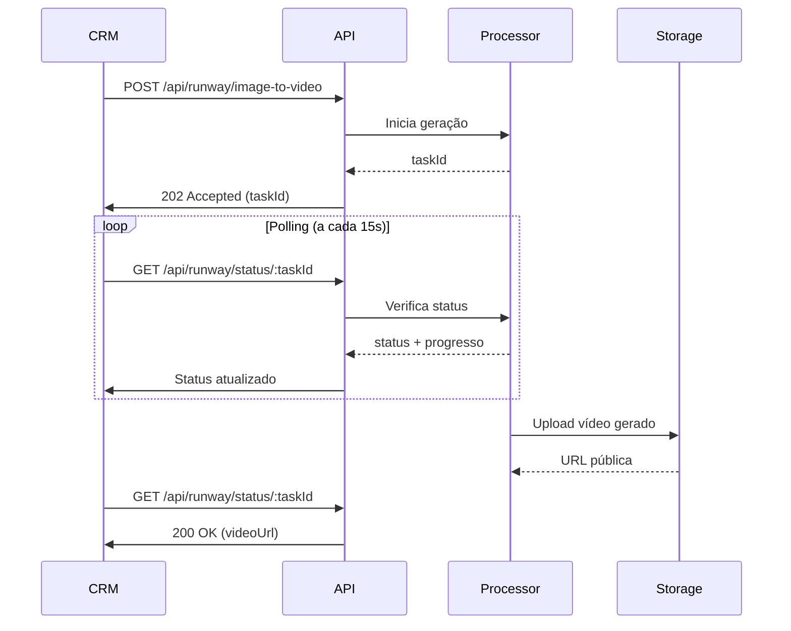

# ✨ Magic Motion - Vídeo com Movimento Cinematográfico

> Transforma imagens estáticas em vídeos com movimento de câmera usando IA

---

## 📋 Visão Geral

O **Magic Motion** adiciona movimento cinematográfico a imagens estáticas:

- **Push in/out:** Aproximação ou afastamento suave da câmera
- **Pan left/right:** Movimento lateral horizontal
- **Tilt up/down:** Movimento vertical
- **Orbit:** Rotação em torno do ambiente
- **Combinações:** Movimentos complexos via prompt customizado

---

## 🎯 Endpoints

### 1️⃣ Iniciar Processamento

```
POST /api/runway/image-to-video
```

**Tipo:** Assíncrono (requer polling)  
**Tempo médio:** 2-5 minutos  
**Timeout inicial:** 30 segundos (apenas para aceitar a requisição)

### 2️⃣ Verificar Status

```
GET /api/runway/status/:taskId
```

**Tipo:** Síncrono (verificação rápida)  
**Polling:** A cada 10-15 segundos

---

## 📨 Request - Iniciar Processamento

### Headers

```
Content-Type: application/json
```

### Body Parameters

| Parâmetro | Tipo | Obrigatório | Default | Descrição |
|-----------|------|-------------|---------|-----------|
| `imageUrl` | string | ✅ | - | URL pública da imagem (JPG/PNG) |
| `promptText` | string | ❌ | `Smooth camera push in` | Descrição do movimento desejado |
| `duration` | number | ❌ | `5` | Duração em segundos (5 ou 10) |
| `aspectRatio` | string | ❌ | `16:9` | Proporção (`16:9`, `9:16`, `1:1`) |

### Exemplo de Request

```bash
curl -X POST https://apiruum-562831020087.us-central1.run.app/api/runway/image-to-video \
  -H "Content-Type: application/json" \
  -d '{
    "imageUrl": "https://storage.example.com/living-room.jpg",
    "promptText": "Smooth camera push in, slow cinematic movement",
    "duration": 5
  }'
```

---

## 📬 Response - Iniciar Processamento

### ✅ Sucesso (202 Accepted)

```json
{
  "success": true,
  "data": {
    "taskId": "runway_abc123xyz",
    "status": "processing",
    "estimatedTime": "3-5 minutes",
    "statusUrl": "https://apiruum.../api/runway/status/runway_abc123xyz",
    "timestamp": "2026-02-02T16:00:00Z"
  },
  "message": "Vídeo em processamento. Use o endpoint de status para verificar."
}
```

### ❌ Erro (4xx/5xx)

```json
{
  "success": false,
  "error": {
    "code": "INVALID_IMAGE_URL",
    "message": "A URL da imagem não está acessível",
    "timestamp": "2026-02-02T16:05:00Z"
  }
}
```

---

## 🔍 Request - Verificar Status

### Endpoint

```
GET /api/runway/status/:taskId
```

### Exemplo

```bash
curl -X GET https://apiruum-562831020087.us-central1.run.app/api/runway/status/runway_abc123xyz
```

---

## 📬 Response - Verificar Status

### ⏳ Processando (200 OK)

```json
{
  "success": true,
  "taskId": "runway_abc123xyz",
  "status": "processing",
  "progress": 65,
  "message": "Vídeo em processamento (65% concluído)",
  "estimatedTimeRemaining": "90 seconds",
  "timestamp": "2026-02-02T16:02:30Z"
}
```

### ✅ Completo (200 OK)

```json
{
  "success": true,
  "taskId": "runway_abc123xyz",
  "status": "completed",
  "data": {
    "videoUrl": "https://storage.googleapis.com/ruum-videos/magic_motion_abc123.mp4",
    "thumbnailUrl": "https://storage.googleapis.com/ruum-videos/thumb_abc123.jpg",
    "metadata": {
      "duration": 5,
      "resolution": "1920x1080",
      "fps": 24,
      "codec": "h264",
      "fileSize": "8.2MB",
      "aspectRatio": "16:9",
      "promptUsed": "Smooth camera push in, slow cinematic movement",
      "processingTime": "3m 42s",
      "timestamp": "2026-02-02T16:03:42Z"
    }
  }
}
```

### ❌ Falhou (200 OK)

```json
{
  "success": false,
  "taskId": "runway_abc123xyz",
  "status": "failed",
  "error": {
    "code": "GENERATION_FAILED",
    "message": "Video generation failed during processing",
    "details": "Imagem não contém conteúdo suficiente para gerar movimento",
    "timestamp": "2026-02-02T16:04:00Z"
  }
}
```

---

## 🎬 Prompts de Movimento

### Movimentos Básicos

| Tipo | Prompt | Efeito |
|------|--------|--------|
| Push In | `Smooth camera push in, slow cinematic movement` | Aproxima da cena |
| Push Out | `Smooth camera pull out, revealing more of the space` | Afasta da cena |
| Pan Right | `Slow camera pan right, smooth horizontal movement` | Move para direita |
| Pan Left | `Slow camera pan left, smooth horizontal movement` | Move para esquerda |
| Tilt Up | `Gentle camera tilt up, vertical movement` | Move para cima |
| Tilt Down | `Gentle camera tilt down, vertical movement` | Move para baixo |
| Orbit | `Slow camera orbit around the room, cinematic rotation` | Rotação circular |

### Prompts Avançados

**Para Salas de Estar:**
```
Smooth dolly in towards the sofa, slow cinematic movement with subtle parallax
```

**Para Varandas/Outdoor:**
```
Gentle camera crane up revealing the city view, slow upward movement
```

**Para Cozinhas:**
```
Slow camera pan across the kitchen, smooth left to right movement showcasing details
```

**Para Quartos:**
```
Soft camera push in towards the bed, dreamy slow motion, cinematic feel
```

### 💡 Dicas para Prompts Eficazes:

1. **Use "slow" ou "smooth"** para evitar movimentos bruscos
2. **Seja específico** sobre a direção (left, right, in, out)
3. **Adicione "cinematic"** para melhor qualidade
4. **Evite múltiplos movimentos** complexos (escolha 1-2 direções)
5. **Mencione o elemento focal** quando relevante

---

## 💡 Exemplos de Uso

### Exemplo 1: Implementação Completa com Polling

```javascript
const axios = require('axios');

async function createMagicMotionVideo(imageUrl) {
  const API_URL = 'https://apiruum-562831020087.us-central1.run.app';
  
  // 1. Inicia processamento
  console.log('🎬 Iniciando processamento...');
  const startResponse = await axios.post(
    `${API_URL}/api/runway/image-to-video`,
    {
      imageUrl,
      promptText: 'Smooth camera push in, slow cinematic movement',
      duration: 5
    },
    {
  
  const { taskId } = startResponse.data.data;
  console.log(`✅ Task iniciada: ${taskId}`);
  
  // 2. Polling até completar
  let attempts = 0;
  const maxAttempts = 40; // 10 minutos (15s * 40)
  
  while (attempts < maxAttempts) {
    await new Promise(resolve => setTimeout(resolve, 15000)); // 15 segundos
    
    const statusResponse = await axios.get(
      `${API_URL}/api/runway/status/${taskId}`,
      { headers }
    
    const { status, data, error } = statusResponse.data;
    
    if (status === 'completed') {
      console.log('✅ Vídeo gerado:', data.videoUrl);
      return data;
    }
    
    if (status === 'failed') {
      console.error('❌ Falha:', error.message);
      throw new Error(error.message);
    }
    
    console.log(`⏳ Processando... (tentativa ${attempts + 1}/${maxAttempts})`);
    attempts++;
  }
  
  throw new Error('Timeout: Processamento excedeu 10 minutos');
}

// Uso
createMagicMotionVideo('https://example.com/living-room.jpg')
  .then(video => console.log('Sucesso!', video))
  .catch(err => console.error('Erro:', err));
```

### Exemplo 2: Com Retry Logic

```javascript
async function createMagicMotionWithRetry(imageUrl, maxRetries = 3) {
  for (let i = 0; i < maxRetries; i++) {
    try {
      return await createMagicMotionVideo(imageUrl);
    } catch (error) {
      if (i === maxRetries - 1) throw error;
      console.log(`🔄 Tentativa ${i + 1} falhou, tentando novamente...`);
      await new Promise(resolve => setTimeout(resolve, 5000));
    }
  }
}
```

### Exemplo 3: Múltiplas Imagens em Paralelo (com limite)

```javascript
async function processMultipleImages(imageUrls) {
  // Processa em lotes de 3 para não sobrecarregar
  const batchSize = 3;
  const results = [];
  
  for (let i = 0; i < imageUrls.length; i += batchSize) {
    const batch = imageUrls.slice(i, i + batchSize);
    const batchResults = await Promise.all(
      batch.map(url => createMagicMotionVideo(url))
    );
    results.push(...batchResults);
    
    console.log(`✅ Lote ${Math.floor(i/batchSize) + 1} completo`);
  }
  
  return results;
}
```

---

## 🔄 Fluxo de Integração



**Tempo total:** 2-5 minutos (dependendo da complexidade)

---

## ⚙️ Configurações e Limites

### Durações Suportadas
- **5 segundos** (recomendado, mais rápido)
- **10 segundos** (maior impacto, mais lento)

### Aspect Ratios
- `16:9` - Landscape (YouTube, web)
- `9:16` - Portrait (Instagram Stories, TikTok)
- `1:1` - Square (Instagram Feed)

### Limites
- **Tamanho máximo da imagem:** 10MB
- **Resolução mínima:** 1024x1024
- **Resolução máxima:** 4096x4096
- **Concurrent tasks:** 5 simultâneos
- **Timeout:** 10 minutos por vídeo

---

## ⚠️ Limitações e Recomendações

### ✅ Imagens Ideais:

- Ambientes com **profundidade** (não fotos muito chapadas)
- **Boa iluminação** e contraste
- **Objetos definidos** para criar parallax
- Resolução mínima: **1920x1080**
- Formatos: JPG, PNG

### ❌ Evite:

- Imagens muito escuras ou superexpostas
- Fotos com muito ruído/granulação
- Imagens panorâmicas muito distorcidas
- Fotos com pessoas em movimento (funciona melhor com ambientes vazios)

### 💡 Dicas de Qualidade:

1. **Use imagens de alta resolução** para melhor qualidade
2. **Push in funciona melhor** que push out na maioria dos casos
3. **Evite movimentos muito rápidos** (use "slow", "smooth")
4. **Teste diferentes prompts** para achar o ideal para cada ambiente
5. **Combine com Before/After** para resultados ainda mais impactantes

---

## 🎯 Combinando com Antes/Depois

Você pode criar um vídeo **super impactante** combinando:

1. **Before/After** → Vídeo comparativo
2. **Magic Motion** → Adiciona movimento ao resultado

### Exemplo:

```javascript
async function createFullPipeline(emptyRoomUrl, stagedRoomUrl) {
  // 1. Gera vídeo Before/After
  const beforeAfter = await axios.post('/api/ffmpeg/before-after', {
    bottom: emptyRoomUrl,
    top: stagedRoomUrl,
    duration: 5
  });
  
  console.log('✅ Before/After gerado:', beforeAfter.data.videoUrl);
  
  // 2. Adiciona movimento à imagem mobiliada
  const magicMotion = await createMagicMotionVideo(stagedRoomUrl);
  
  console.log('✅ Magic Motion gerado:', magicMotion.videoUrl);
  
  return {
    beforeAfter: beforeAfter.data.videoUrl,
    magicMotion: magicMotion.videoUrl
  };
}
```

---

## 📊 Métricas de Performance

| Métrica | Valor Médio | P95 | P99 |
|---------|-------------|-----|-----|
| Tempo de processamento (5s) | 3m 20s | 4m 45s | 6m 10s |
| Tempo de processamento (10s) | 4m 50s | 6m 30s | 8m 15s |
| Taxa de sucesso | 94% | - | - |
| Tamanho do arquivo (5s) | 7.5 MB | 10 MB | 12 MB |

---

## 🐛 Troubleshooting

### Problema: "GENERATION_FAILED"
**Causa:** Imagem não tem conteúdo suficiente para movimento  
**Solução:** Use imagens com mais objetos/profundidade

### Problema: Timeout após 10 minutos
**Causa:** Servidor Runway sobrecarregado  
**Solução:** Tente novamente em alguns minutos

### Problema: Movimento muito rápido/brusco
**Causa:** Prompt sem "slow" ou "smooth"  
**Solução:** Adicione "slow", "smooth", "gentle" ao prompt

### Problema: Vídeo com artefatos/glitches
**Causa:** Imagem de baixa qualidade ou muito comprimida  
**Solução:** Use imagem de alta resolução e qualidade

---

## 📚 Referências Relacionadas

- [Quick Start Guide](./QUICKSTART.md) - Implementação básica com polling
- [Before/After Video](./VIDEO_BEFORE_AFTER.md) - Combine com este
- [Magic Drop](./VIDEO_MAGIC_DROP.md) - Outra opção de vídeo com IA
- [Error Codes](./ERROR_CODES.md) - Troubleshooting completo

---

**Dúvidas?** renato@ruum.com.br
